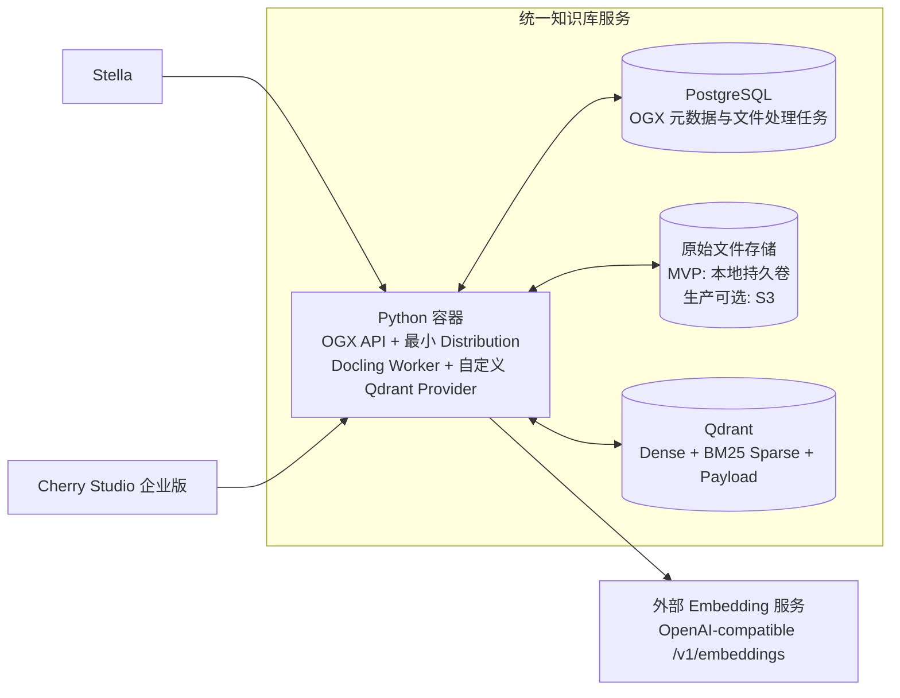
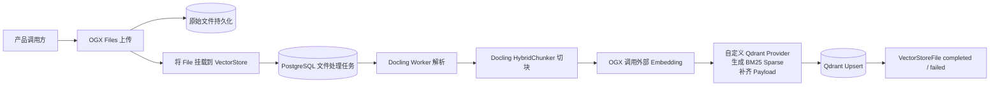
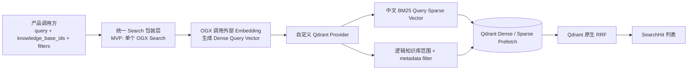

# Stella × Cherry Studio 企业版统一知识库服务方案

> 状态：方案已确认，OGX 原生 MVP 实施中
>
> 当前实施基线：OGX `v1.3.0` 最小 Distribution + 自定义 Qdrant Provider
>
> 适用范围：Stella 与 Cherry Studio 企业版的服务端知识库基础设施

## 1. 问题与目标

Stella 与 Cherry Studio 企业版都需要文档上传、原文保存、解析、切块、向量化、索引、过滤检索、删除和状态管理能力。两者都是服务端产品，部署形态和基础容量要求接近，但业务对象和权限模型不同：

- Stella 延续 `system / system_agent / user / user_agent` 四级累加范围。
- Cherry Studio 企业版把公司、部门、产品等知识库作为显式业务对象，并按产品权限决定当前用户挂载哪些知识库。

本项目建设一套可独立部署的知识库基础设施，让两侧复用同一套文件处理和检索内核。产品负责判断调用者能访问什么，知识库服务只执行产品传入的逻辑知识库范围和通用过滤表达式，不理解公司、部门、Agent、用户等业务语义。

目标如下：

1. 复用成熟开源能力，避免重新实现文件、VectorStore、解析、切块和任务基础设施。
2. 让 Stella 与企业版使用一致的 Docling 解析、HybridChunker 切块、Dense + 真 BM25 混合检索和结果结构。
3. 在 Qdrant 中正确执行逻辑知识库隔离和产品权限过滤，避免先召回再过滤造成漏召回或越权。
4. 以一个 Docker Compose 在本地完成可验证 MVP，并能演进到每个客户环境独立部署。
5. 把长期自维护范围尽量收敛到最小 OGX Distribution、外置 Qdrant Provider、部署配置和兼容性测试。

## 2. 范围与非目标

### 2.1 本方案范围

- OGX Files、VectorStore、VectorStoreFile 和文件处理任务能力。
- 本地文件系统原文存储；生产环境保留切换 S3 兼容存储的能力。
- Docling 文档解析和 Docling `HybridChunker` 切块。
- 外部 OpenAI-compatible Embedding 服务。
- Qdrant Dense 向量、BM25 Sparse 向量、Payload Filter 和 RRF。
- PostgreSQL 中的 OGX 文件元数据、VectorStore 元数据和内部任务数据。
- Stella 四级范围与企业版显式知识库到统一对象和 Qdrant Payload 的映射。
- MVP 原生接口、后续统一产品接口，以及文件和逻辑知识库的管理接口。

### 2.2 非目标

- 不替换 Stella 当前内置的基础 Library；本服务是额外的增强知识库选项。
- 不考虑 Cherry Studio 社区版和桌面端内嵌交付。
- 不在知识库服务中实现 Stella 或企业版的用户、组织、角色和授权规则。
- 不建设跨客户共享的全局知识库；默认一个客户环境部署一套服务。
- MVP 不支持多副本 OGX 服务，不为超大规模或高并发提前设计分片调度。
- MVP 不提供 OCR、VLM 解析和神经 Reranker。
- MVP 不引入自定义 `Document / Revision` 领域模型，也不承诺 Revision 原子切换。
- 不启用 OGX 的 Responses、Agent、Messages、Tools、Eval 等无关 API。
- 不引入 Haystack、PgQueuer、River、Weaviate 或额外 FastAPI 服务。

## 3. 约束与已知事实

### 3.1 产品边界

```text
产品权限层
Stella / Cherry Studio 企业版判断本次请求可以访问什么
        ↓
产品存储路由与映射层
生成 knowledge_base_id 列表和通用 metadata filter
        ↓
统一知识库能力层
文件、解析、切块、Embedding、索引、过滤检索和删除
```

- 产品权限层是权限规则的唯一来源。
- 知识库服务必须忠实执行过滤条件，但不解释字段的业务含义。
- 产品数据库保存组织关系、挂载关系和权限；知识库 PostgreSQL 保存 OGX 自己的资源与任务状态。
- 两个 PostgreSQL 连接可以指向同一实例中的不同逻辑数据库，也可以指向独立实例。MVP 为隔离变量使用独立 PostgreSQL 容器。
- Embedding Endpoint、模型 ID 和维度由每套部署配置。维度在 Collection 初始化后保持不变；模型 ID 不在代码中固定。当前范围不设计已有数据的模型切换流程。

### 3.2 Stella 当前四级范围

以 Stella `upstream/main` 提交 `7686b32987d4f7a26b259c0be84f9b9386f96dac` 为事实基线，当前 Library 文件归属为：

| scope | user_id | agent_id | 当前运行时可见条件 |
| --- | --- | --- | --- |
| `system` | 空 | 空 | 所有用户和 Agent |
| `system_agent` | 空 | 指定 Agent | 当前 Agent 相同 |
| `user` | 指定用户 | 空 | 当前用户相同 |
| `user_agent` | 指定用户 | 指定 Agent | 当前用户和当前 Agent 都相同 |

当前检索语义是四路累加，不是四选一。统一知识库必须保持这个语义，只把 SQL 条件改写成等价的 Qdrant Payload Filter。

### 3.3 OGX v1.3.0 的真实能力边界

- OGX 已提供 Files、VectorStore、VectorStoreFile、文件批次、状态和 OpenAI-compatible API。
- OGX Files 支持本地文件系统和 S3 后端。
- Docling Provider 以 Worker 模式运行，实际使用 `HybridChunker`；`auto` 和 `static` 策略都会进入 HybridChunker。
- OGX 内置任务底座是 PostgreSQL 持久队列，具备租约、Worker 崩溃重启和最多 3 次尝试；`v1.3.0` 只有 File Processor 使用这套 Worker 模式。
- `POST /v1/vector_stores/{id}/files` 会等待 File Processor 任务完成，然后在 OGX Server 进程中继续调用 Embedding 和 VectorIO。Embedding 与 Qdrant 写入不是一项完整的持久任务。
- 官方 Qdrant Provider 为每个 VectorStore 创建一个 Collection；拒绝传入 metadata filter；所谓 keyword search 是文本匹配且固定返回 `1.0` 分数，不是真 BM25；所谓 hybrid 也不是 Dense 与 BM25 排名的 RRF。
- 因此官方 Qdrant Provider 不能直接满足本项目，但 OGX 的对象模型、接口、Files、Docling 和任务底座仍可复用。

## 4. 候选方案与权衡

| 路线 | 能直接复用什么 | 我们必须维护什么 | 初次成本 | 长期成本 | 结论 |
| --- | --- | --- | --- | --- | --- |
| 原样使用 OGX 官方 Qdrant Provider | OGX 全部管理和处理能力 | 很少 | 最低 | 低 | 不满足过滤、真 BM25、共享 Collection 和正确混合检索，淘汰 |
| OGX 最小 Distribution + 外置 Qdrant Provider | Files、VectorStore、VectorStoreFile、Docling、HybridChunker、Embedding 调用、文件处理任务、管理 API | Qdrant 数据映射、过滤、BM25、RRF、删除和部署配置 | 中 | 中；核心风险集中在 Provider | 选定 |
| Haystack + 自建知识库服务 | Pipeline、DocumentStore 接口和检索组件 | API、对象模型、Files、任务状态、生命周期、恢复、删除、部署和大量胶水代码 | 高 | 逻辑更自由，但长期维护面更大 | 当 OGX 对象或任务语义不再可接受时再切换 |

选择 OGX 的前提不是认为它无需开发，而是接受以下取舍：

1. 采用 OGX 的 `File / VectorStore / VectorStoreFile` 模型，不额外发明 `Document / Revision`。
2. MVP 不要求更新版本的原子发布。
3. MVP 先验证 OGX 原生单 VectorStore 链路，统一的 `ingest / search` 包装接口随后实现。
4. 接受文件解析任务可靠、Embedding 与索引阶段只能通过幂等写入和显式重试恢复。
5. 固定 OGX `v1.3.0` 开发；未来可选择跟进上游，也可以长期固定版本，不把持续跟随上游作为硬要求。

如果未来必须具备自定义 Revision 生命周期、完整导入任务的端到端持久化、复杂可插拔 Pipeline 或多副本独立扩缩容，Haystack 自建路线会重新变得更合适。

## 5. 最终方案

### 5.1 部署结构



MVP Docker Compose 只部署三个服务：

| 服务 | 运行时 | 职责 | 是否必需 |
| --- | --- | --- | --- |
| `knowledge-ogx` | Python | OGX API、Files、Docling Worker、HybridChunker、自定义 Qdrant Provider | 是 |
| `postgres` | PostgreSQL | OGX 文件与 VectorStore 元数据、内部文件处理任务 | 是 |
| `qdrant` | Rust | Dense、BM25 Sparse、Payload Index、过滤检索和 RRF | 是 |

原始文件使用挂载到 `knowledge-ogx` 的持久卷，不是第四个服务。Embedding Endpoint 是外部依赖，不进入本次 Compose。Qdrant 和 PostgreSQL 不直接暴露给 Stella 或企业版。

### 5.2 最小 OGX Distribution

运行时只启用四类 API：

| API | Provider | 用途 |
| --- | --- | --- |
| `files` | `inline::localfs` | 保存原始文件和文件元数据 |
| `file_processors` | `inline::docling` | 解析文档并使用 Docling HybridChunker 切块 |
| `inference` | OpenAI-compatible remote provider | 生成文档和查询的 Dense Embedding |
| `vector_io` | 本项目外置 Qdrant Provider | 保存和检索 Dense、BM25 与 Payload |

MVP 将 Docling 配置为 `do_ocr=false`、不配置 VLM，并使用已确认的 HybridChunker 默认目标 `800` tokens、overlap `400` tokens。OGX v1.3.0 的持久任务池固定启动两个 Worker；`ServerConfig` 没有暴露 `job_workers` 字段，因此本项目不修改 Core 只为减少一个 Worker。这些参数在格式与资源测试后可以调整。

OGX Docling Provider 会构造默认 `HybridChunker`，其 tokenizer 来自 `sentence-transformers/all-MiniLM-L6-v2`。镜像构建必须分别固定 tokenizer、Transformers layout 与 Accurate TableFormer 的 commit，只预置当前 PDF Pipeline 实际使用的模型变体；构建阶段在离线模式初始化 PDF Pipeline，避免首次导入临时联网。该 tokenizer 只服务切块计数，不参与 Dense Embedding；若后续要求与实际 Embedding 模型严格使用同一 tokenizer，需要扩展 Docling Provider，而不是靠部署配置假装已经一致。

安装包可以包含 OGX 的其他模块代码，但配置不注册、不启动无关 API。首期不物理拆解 OGX 源码，以避免形成难以升级的内部 Fork。

### 5.3 导入链路



必须准确理解任务边界：PostgreSQL 持久任务覆盖 `Docling Worker 解析 + HybridChunker`；Embedding、BM25 编码和 Qdrant Upsert 发生在 Worker 返回之后，不属于同一个持久任务。

### 5.4 检索链路



MVP 默认检索模式为 `hybrid`：Dense 与 BM25 使用完全相同的 Payload Filter，再由 Qdrant Query API 执行 RRF。过滤不是检索后的二次裁剪。

图中 `knowledge_base_ids` 是目标产品接口。MVP 调用 OGX 原生接口时一次只有一个 `vector_store_id`；原生链路通过后，同一 Python 服务内增加薄包装层，把多个 ID 转成 `vector_store_id IN [...]` 并进入一次 Provider/Qdrant 查询，不增加新的部署组件。

### 5.5 OGX 对象与物理存储映射

| 层级 | 含义 | 存放位置 |
| --- | --- | --- |
| `File` | 一份原始文件及其身份 | 原文件在本地卷/S3；元数据在 PostgreSQL |
| `VectorStore` | 一个逻辑知识库或逻辑检索集合 | PostgreSQL；其 ID 写入 Qdrant Payload |
| `VectorStoreFile` | File 挂载到某个 VectorStore 的关系及 attributes | PostgreSQL |
| Chunk Point | 某次 File 挂载产生的可检索切块 | Qdrant |
| Collection | 一个客户环境或租户的物理索引边界 | Qdrant |

`VectorStore` 不对应独立 Qdrant Collection。一个部署默认只有一个 Collection，多个逻辑 VectorStore 通过 `vector_store_id` Payload 区分。新增部门知识库只是新增一个 VectorStore 和新的 `vector_store_id` 值，不创建 Payload Index，也不重建 HNSW。

### 5.6 Qdrant Point 结构

```text
Point
├── id = hash(vector_store_id + chunk_id)
├── vectors
│   ├── dense = 外部 Embedding
│   └── bm25  = 中文 BM25 Sparse Vector
└── payload
    ├── vector_store_id          # 保留字段，逻辑知识库隔离
    ├── file_id                  # 保留字段，文件删除与溯源
    ├── chunk_id                 # OGX Chunk 标识
    ├── attributes               # 产品写入的通用过滤字段
    └── chunk_content            # 可恢复为 OGX EmbeddedChunk 的完整内容
```

Point ID 必须包含 `vector_store_id`。同一个 File 可以挂载到多个 VectorStore；如果只使用 `chunk_id`，后一次挂载会覆盖前一次挂载的数据。

Collection 初始化时至少创建以下 Payload Index：

- `vector_store_id`：keyword，必需。
- `file_id`：keyword，必需。
- 部署配置中声明的高频过滤字段，例如 `attributes.scope`、`attributes.user_id`、`attributes.agent_id`。

Provider 支持 OGX 的 `eq / ne / gt / gte / lt / lte / in / nin / and / or` 通用过滤协议。任意字段可以参与过滤；需要高性能和 Filter-aware HNSW 的字段必须在部署配置中声明名称和类型。两侧按自己的 Payload 字段配置，Provider 只理解字段与类型，不理解权限含义。

在已有数据的 Collection 中增加一个新的 `vector_store_id` 值不需要新增索引。增加一种此前不存在的高频过滤字段属于 Collection Schema 迁移，应单独评估 Payload Index 创建和 HNSW 优化成本。

### 5.7 Dense + 中文 BM25 + RRF

- Dense 文档向量和查询向量都由 OGX Inference API 调用同一个外部 Embedding 模型生成。
- Provider 为文档和查询传入完全相同的 Qdrant 原生 multilingual BM25 配置。
- Qdrant 保存 BM25 Sparse Vector，并使用动态 IDF 能力参与评分。
- Dense 与 Sparse 在同一 Collection、同一过滤条件下分别 Prefetch。
- 最终融合由 Qdrant 原生 RRF 完成；Haystack 不参与，OGX Server 不再做第二次跨库融合。

MVP 已比较两条做法：

1. Jieba 精确/搜索模式 + 自定义或 FastEmbed-compatible BM25 Sparse Encoder。
2. Qdrant 1.18.2 服务端 `qdrant/bm25` + multilingual tokenizer。

8 篇文档、9 条工程查询的冒烟语料中，两条路线均为 9/9 Top1、MRR 1.0，未发现明显效果回归。当前暂定第二条路线：它由 Qdrant 统一完成分词、TF/长度权重和动态 IDF，可以删除生产路径中的 Jieba、mmh3、自定义 token hash 与权重公式。该小型语料不足以证明真实业务效果；后续若 Stella 或企业版语料验证较差，再以已保留的评测基线重新考虑 Jieba。

## 6. 两侧的数据映射与维护边界

### 6.1 Stella

Stella 在每套部署中使用一个固定的隐藏 VectorStore，不为每个用户或 Agent 创建 VectorStore。四级范围全部写入 Chunk Payload。

推荐 Payload：

```json
{
  "scope": "system | system_agent | user | user_agent",
  "user_id": "仅 user / user_agent 填写",
  "agent_id": "仅 system_agent / user_agent 填写"
}
```

当前用户 `U` 和 Agent `A` 的查询过滤条件为：

```text
vector_store_id = STELLA_HIDDEN_VECTOR_STORE
AND (
  scope = system
  OR (scope = system_agent AND agent_id = A)
  OR (scope = user AND user_id = U)
  OR (scope = user_agent AND user_id = U AND agent_id = A)
)
```

Stella 负责：

- 从可信运行时身份生成上述过滤表达式。
- 在上传时写入合法的 scope 与 owner 字段，禁止客户端伪造 owner。
- 保留自己的权限判断、管理 UI、配额和产品数据库映射。
- 在用户、Agent 或文件删除时调用统一知识库的对应删除接口。

Stella 通常不需要面向用户展示 VectorStore 创建、命名和列表功能；隐藏 VectorStore 在部署初始化时创建。

### 6.2 Cherry Studio 企业版

公司、部门、产品等知识库是显式业务对象，需要创建、展示、修改、挂载和删除。每个业务知识库一对一映射一个 OGX VectorStore，但所有 VectorStore 仍写入同一个 Qdrant Collection。

企业版产品数据库保存：

- 知识库属于哪个公司、部门或产品。
- 用户、组织、角色与知识库的授权和挂载关系。
- 业务展示所需的扩展字段。
- 业务知识库 ID 与 OGX `vector_store_id` 的映射。

创建知识库时，企业版创建业务对象并调用统一知识库的 VectorStore 创建接口，然后保存返回的 `vector_store_id`。检索时，企业版先算出当前请求挂载的知识库列表，再把这些 ID 作为 `knowledge_base_ids` 传给统一检索接口。

多个企业版知识库在目标接口中会转换为：

```text
vector_store_id IN [公司知识库, 部门A知识库, 产品B知识库]
```

因为这些数据位于同一个 Collection，这是一条带过滤的 Dense + BM25 + RRF 查询，不需要分别搜索多个物理库后再次融合。

### 6.3 统一知识库服务

统一知识库负责：

- File、VectorStore、VectorStoreFile 和文件处理状态。
- 原文件保存、Docling 解析、HybridChunker 切块。
- Embedding 调用、中文 BM25 编码、Qdrant 写入与删除。
- 通用 Filter 校验、翻译和完整执行。
- Dense + BM25 + RRF 及稳定的 SearchHit 输出。
- PostgreSQL、Qdrant 和原始文件之间的生命周期一致性与恢复工具。
- 部署配置、版本固定、迁移、备份恢复说明和可观测性。

统一知识库不提供用户管理接口，也不保存产品的完整权限规则。

## 7. 关键行为与接口

### 7.1 MVP 先使用 OGX 原生接口

| 行为 | 接口 | 说明 |
| --- | --- | --- |
| 创建逻辑知识库 | `POST /v1/vector_stores` | Stella 初始化一次；企业版按业务知识库创建 |
| 上传原文件 | `POST /v1/files` | multipart 上传并先持久化原文件 |
| 挂载并处理文件 | `POST /v1/vector_stores/{vector_store_id}/files` | 传 `file_id`、attributes 和 chunking strategy；当前调用会等待完整处理结果 |
| 查询挂载状态 | `GET /v1/vector_stores/{vector_store_id}/files/{file_id}` | 返回 `in_progress / completed / failed` 等状态 |
| 混合检索 | `POST /v1/vector_stores/{vector_store_id}/search` | `search_mode=hybrid`，支持 filters 和结果数量 |
| 删除文件挂载 | `DELETE /v1/vector_stores/{vector_store_id}/files/{file_id}` | 删除该逻辑知识库内对应 Point |
| 删除原文件 | `DELETE /v1/files/{file_id}` | 只在没有其他 VectorStore 使用时执行 |
| 删除逻辑知识库 | `DELETE /v1/vector_stores/{vector_store_id}` | 只删除该 ID 对应 Point，不删除整个物理 Collection |
| 查看解析任务 | `/v1alpha/file-processors/jobs...` | 仅表示 File Processor 任务，不代表完整导入任务 |

MVP 的首要目标是验证原生单 VectorStore 链路。原生链路通过后，再增加产品侧友好的统一接口；不在 MVP 前同时维护两套未经验证的接口。

### 7.2 目标产品接口

最终对 Stella 和企业版提供两个核心业务接口，辅助接口继续复用或包装 OGX 对象管理 API。

#### `POST /knowledge/v1/ingest`

用于在一次产品调用中完成“上传 File + 挂载 VectorStore”。MVP 已确定使用同步语义，返回时 `status` 是 `completed` 或 `failed`，不新增完整导入任务实体。

| 字段 | 必须 | 含义 |
| --- | --- | --- |
| `file` | 是 | 原始文件二进制及文件名 |
| `knowledge_base_id` | 是 | 逻辑知识库 ID；映射 OGX VectorStore 和 Qdrant `vector_store_id`，不是物理 Collection ID |
| `attributes` | 否 | 产品写入的通用过滤元数据；Stella 在这里写四级范围字段 |

返回固定包含：`file_id`、`knowledge_base_id`、`status` 和可选 `last_error`。上传完成后若后续处理失败，原文件和失败挂载记录保留，调用方使用辅助接口显式删除或重试。

#### `POST /knowledge/v1/search`

| 字段 | 必须 | 含义 |
| --- | --- | --- |
| `query` | 是 | 用户检索文本 |
| `knowledge_base_ids` | 是 | 本次允许检索的一个或多个逻辑知识库 ID；Stella 通常只有固定隐藏 ID |
| `filters` | 否 | 产品生成的通用 metadata filter；不能覆盖保留字段 |
| `mode` | 否 | `hybrid / dense / bm25`，默认 `hybrid` |
| `limit` | 否 | 返回数量，使用服务端上限约束 |

返回 `{ "hits": SearchHit[] }`；每个 `SearchHit` 固定包含 `file_id`、`chunk_id`、`content`、`locator`、`score` 和 `attributes`。不向产品暴露 Qdrant Point 或内部 `EmbeddedChunk` 结构。

### 7.3 辅助接口及两侧使用差异

| 能力 | Stella | Cherry Studio 企业版 |
| --- | --- | --- |
| 创建、命名、展示和修改知识库 | 仅部署初始化，通常不面向用户 | 需要，知识库是显式业务对象 |
| 上传、查看和删除文件 | 需要 | 需要 |
| 挂载多个知识库检索 | 固定隐藏知识库 + 四级 Filter | 需要，按业务权限生成知识库 ID 列表 |
| 查询处理状态 | 需要 | 需要 |
| 删除整个知识库 | 部署清理等少量场景 | 需要 |
| 用户管理 | 不由知识库服务提供 | 不由知识库服务提供 |

## 8. 生命周期与失败恢复

### 8.1 文件替换

MVP 没有 Revision。替换文件采用：

1. 上传新 File。
2. 挂载新 File 并等待完成。
3. 新 File 可检索后，删除旧 VectorStoreFile。
4. 旧 File 没有其他挂载后再删除原文。

这不是原子切换，短时间内可能同时检索到新旧版本。该限制是选择 OGX 原生文件模型的明确取舍。

### 8.2 幂等与重试

- Qdrant Point ID 使用 `hash(vector_store_id + chunk_id)`，重复 Upsert 覆盖同一 Point，不生成重复数据。
- Docling Worker 崩溃后由 OGX Job Queue 回收租约并重试，默认最多 3 次。
- OGX Server 在 Embedding 或 Qdrant Upsert 阶段崩溃时，完整导入不会自动恢复。调用方需要重试挂载操作。
- 如果 OGX 已经保存了 `failed` VectorStoreFile，同一个 attach 请求只会返回已有对象，不会自动重跑；恢复协议必须先删除失败挂载，再重新 attach。
- MVP 必须通过故障注入验证“删除失败挂载 + 重新挂载”不会遗留重复 Point、跨 VectorStore 数据或错误完成状态。

### 8.3 删除

- 删除 VectorStoreFile 只删除对应 `(vector_store_id, file_id)` 的 Chunk Point。
- 删除 VectorStore 按 `vector_store_id` Filter 删除其全部 Point，不删除共享 Collection。
- 删除 File 前必须确认没有其他 VectorStoreFile 引用；同一 File 多次挂载是合法行为。
- 产品删除权限对象时，先由产品计算需要清理的 File/VectorStore，再调用知识库接口；Provider 不理解用户或组织生命周期。

## 9. 验收与测试策略

### 9.1 硬性验收项

| 类别 | 验收内容 | 通过标准 |
| --- | --- | --- |
| 最小 Distribution | 只启用 Files、File Processors、Inference、VectorIO | 无关 OGX API 不注册或不可用 |
| 外置 Provider | 不修改 OGX Core 即可加载 | Provider 通过外部入口完成注册和初始化 |
| 原文 | 上传后重启 OGX 仍可读取 | 文件字节与元数据一致 |
| 解析与切块 | Docling + HybridChunker 处理目标格式 | Chunk 有稳定内容、顺序和定位信息 |
| Dense | 语义查询可召回相关 Chunk | 结果、分数和来源可解析 |
| BM25 | 中文关键词和标识符可按相关性排序 | 不是固定分数或文本 Filter 冒充 BM25 |
| Hybrid | Dense + BM25 使用相同 Filter 并由 Qdrant RRF 融合 | 结果顺序可复现，无越权候选 |
| Stella 四级范围 | 覆盖四级正向和反向矩阵 | 不漏掉合法范围，不返回非法范围 |
| 企业版多知识库 | 同一查询过滤多个 `vector_store_id` | 一次 Qdrant 查询得到融合结果 |
| 新增知识库 | 已有 Collection 中创建新 VectorStore | 不新增 Collection，不重建 Payload Index |
| 多重挂载 | 同一 File 挂载两个 VectorStore | Point 不互相覆盖，删除一侧不影响另一侧 |
| 删除 | 删除挂载、File 和 VectorStore | Qdrant、PostgreSQL、原文符合预期生命周期 |
| 解析恢复 | 处理时终止 Docling Worker | 任务被重新租约并在尝试预算内完成或失败 |
| 全链路恢复 | Embedding/Upsert 时终止 OGX | 显式恢复协议可修复且无重复、串库和假完成 |
| 持久化 | 分别重启 OGX、PostgreSQL、Qdrant | 已完成资源和检索结果仍存在 |
| 资源测量 | 空闲、解析、Embedding、导入、检索 | 记录 CPU、内存、磁盘和延迟，为生产配额提供证据 |

### 9.2 中文检索评测

使用同一批中文文档和查询比较 Jieba 路线与 multilingual tokenizer，至少包含：

- 中文自然语言问题。
- 人名、产品名、部门名和中英混合词。
- 型号、错误码、缩写和精确标识符。
- Dense 擅长、BM25 擅长和两者互补的查询。

只有评测结果和实现复杂度都可接受，才能确定最终 BM25 Encoder。

## 10. 风险

| 风险 | 影响 | 处理方式 |
| --- | --- | --- |
| 自定义 Provider 承担核心检索语义 | 它不是薄适配层，错误会造成漏召回、串库或错误删除 | 单元测试过滤翻译；集成测试 Qdrant；以 OGX 官方 Provider 和 Qdrant 官方示例为参考，但独立维护契约测试 |
| 完整导入不是持久任务 | OGX Server 崩溃后不能自动续跑 Embedding/Upsert | MVP 接受显式恢复；用幂等 Point ID、失败挂载删除重试和对账工具降低代价 |
| Qdrant 原生 BM25 与服务版本耦合 | tokenizer 选项或语言处理在升级后可能改变 | 固定 Qdrant 1.18.2；文档和查询共用同一配置；升级必须重跑原生 BM25 探针与真实语料评测 |
| 产品生成错误 Filter | 可能漏数据或越权 | 产品只从可信身份生成；服务校验语法和保留字段；为 Stella 与企业版权限矩阵建立契约测试 |
| 新增高频过滤字段 | 已有 Collection 可能需要索引迁移和 HNSW 优化 | 常用字段在建 Collection 前声明；字段变更走显式迁移，不与“新增知识库值”混淆 |
| 已有数据直接更换 Embedding 模型 | 即使维度相同，新旧向量空间通常也不兼容；OGX VectorStore 还会保存原模型 ID | 当前不支持，也不纳入本期；若未来提出该需求，再单独设计 |
| OGX 模型注册信息与配置漂移 | 原地修改模型后可能因自动发现记录类型冲突而启动失败 | 模型迁移同时处理 PostgreSQL Registry 与 Qdrant 全量重建；不把修改环境变量当成完整迁移 |
| 无 Revision 原子发布 | 文件替换存在短时双版本 | MVP 明确接受；若成为硬需求，重新评估扩展 OGX 或切换 Haystack |
| OGX 上游变化 | 升级可能破坏 Provider 契约 | 固定 v1.3.0；升级必须通过兼容性测试，允许选择不跟进 |
| 单实例限制 | 无法独立横向扩展 API 和导入吞吐 | 当前客户部署和规模接受；多副本成为需求时重新设计 |
| 公开仓库泄露凭证或遗漏第三方许可声明 | 安全与合规风险 | 所有密钥只从环境/Secret 注入；不提交真实 Endpoint Token；项目采用 MIT License，复用第三方代码时保留其许可声明 |

## 11. 未决问题

以下问题不改变 OGX + Qdrant 方案，可以在后续实施中确定：

1. 生产环境原始文件使用本地持久卷还是 S3。
2. Reranker 的模型、接入位置和启用条件。

MVP 已完成真实 OpenAI-compatible Embedding 与第一轮两侧实际项目文档评测：0.6B、4B、8B 三种模型分别返回 1024、2560、4096 维向量，并都能完成完整导入和 Hybrid 检索。这一轮用于验证模型服务兼容性、维度配置和检索链路，不用于在架构阶段固定具体模型。后续使用更大业务语料，综合效果、延迟和成本再确定部署模型；如果 multilingual BM25 或 Dense 在扩大语料后退化，再加入 Jieba 或 Reranker 对照。

Qdrant Server 已固定为 `1.18.2`，qdrant-client 已固定为 `1.18.0`；真实探针已覆盖 IDF Sparse、Payload Filter、Query API 和原生 RRF，因此版本能力不再是未决项。

真实模型服务和可配置维度已经不再阻塞 MVP 完整导入。具体模型选型属于后续效果与性能调优，不阻塞当前 Provider 和统一 API 验证。

## 12. 参考事实来源

- [OGX v1.3.0](https://github.com/ogx-ai/ogx/tree/v1.3.0)
- [OGX v1.3.0 Qdrant Provider](https://github.com/ogx-ai/ogx/blob/v1.3.0/src/ogx/providers/remote/vector_io/qdrant/qdrant.py)
- [OGX OpenAI VectorStore Mixin](https://github.com/ogx-ai/ogx/blob/v1.3.0/src/ogx/providers/utils/memory/openai_vector_store_mixin.py)
- [OGX Job Execution Substrate](https://github.com/ogx-ai/ogx/blob/v1.3.0/src/ogx/core/jobs/README.md)
- [OGX Docling Provider](https://github.com/ogx-ai/ogx/tree/v1.3.0/src/ogx/providers/inline/file_processor/docling)
- [Qdrant Filtering](https://qdrant.tech/documentation/search/filtering/)
- [Qdrant Payload Indexing](https://qdrant.tech/documentation/manage-data/indexing/)
- [Qdrant Hybrid Queries 与 RRF](https://qdrant.tech/documentation/search/hybrid-queries/)
- [Qdrant Text Search](https://qdrant.tech/documentation/search/text-search/)
- [Docling HybridChunker](https://docling-project.github.io/docling/_generated/examples/hybrid_chunking/)
- [Stella Library 数据模型](https://github.com/CherryHQ/stella/blob/7686b32987d4f7a26b259c0be84f9b9386f96dac/internal/db/migrations/90000000000007_replace_knowledge_with_library.sql)
- [Stella Library 四级检索](https://github.com/CherryHQ/stella/blob/7686b32987d4f7a26b259c0be84f9b9386f96dac/internal/db/queries/library.sql)
