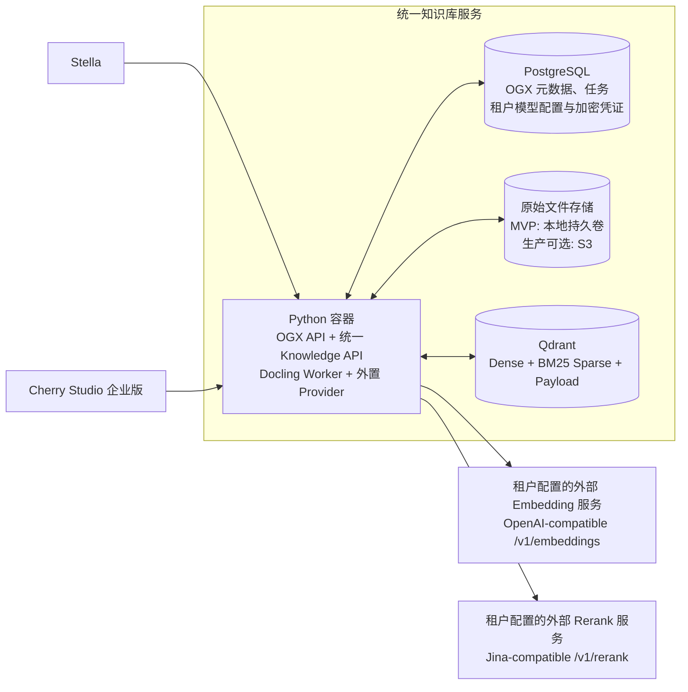
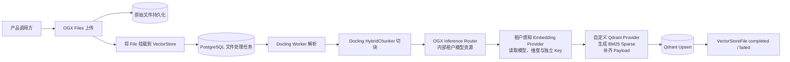
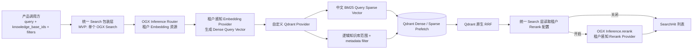

# Stella × Cherry Studio 企业版统一知识库服务方案

> 状态：OGX 原生 MVP 与目标产品接口已实现并通过本地端到端验证
>
> 当前实施基线：OGX `v1.3.0` 最小 Distribution + 自定义 Qdrant Provider
>
> 适用范围：Stella 与 Cherry Studio 企业版的服务端知识库基础设施

## 1. 问题与目标

Stella 与 Cherry Studio 企业版都需要文档上传、原文保存、解析、切块、向量化、索引、过滤检索、删除和状态管理能力。两者都是服务端产品，部署形态和基础容量要求接近，但业务对象和权限模型不同：

- Stella 延续 `system / system_agent / user / user_agent` 四级累加范围。
- Cherry Studio 企业版把公司、部门、产品等知识库作为显式业务对象，并按产品权限决定当前用户挂载哪些知识库。

本项目建设一套可独立部署的知识库基础设施，让两侧复用同一套文件处理和检索内核。产品负责判断调用者能访问什么，知识库服务只执行产品传入的逻辑知识库范围和通用过滤表达式，不理解公司、部门、Agent、用户等业务语义。

目标如下：

1. 复用成熟开源能力，避免重新实现文件、VectorStore、解析、切块和任务基础设施。
2. 让 Stella 与企业版使用一致的 Docling 解析、HybridChunker 切块、Dense + 真 BM25 混合检索和结果结构。
3. 在 Qdrant 中正确执行逻辑知识库隔离和产品权限过滤，避免先召回再过滤造成漏召回或越权。
4. 以一个 Docker Compose 在本地完成可验证 MVP，并能演进到每个客户环境独立部署。
5. 把长期自维护范围收敛到最小 OGX Distribution、统一 Knowledge API、外置 Qdrant Provider、租户感知 Inference Provider、部署配置和兼容性测试。

## 2. 范围与非目标

### 2.1 本方案范围

- OGX Files、VectorStore、VectorStoreFile 和文件处理任务能力。
- 原文存储支持本地持久卷和 S3-compatible 两种部署选项，对外使用同一套 File/Ingest 接口。
- Docling 文档解析和 Docling `HybridChunker` 切块。
- 外部 OpenAI-compatible Embedding 服务。
- Qdrant Dense 向量、BM25 Sparse 向量、Payload Filter 和 RRF。
- 每租户独立 URL、凭证、模型选择和开关的远程神经 Reranker；部署只限定候选上限、超时和网络安全策略。
- PostgreSQL 中的 OGX 文件元数据、VectorStore 元数据和内部任务数据。
- Stella 四级范围与企业版显式知识库到统一对象和 Qdrant Payload 的映射。
- MVP 原生接口、后续统一产品接口，以及文件和逻辑知识库的管理接口。

### 2.2 非目标

- 不替换 Stella 当前内置的基础 Library；本服务是额外的增强知识库选项。
- 不考虑 Cherry Studio 社区版和桌面端内嵌交付。
- 不在知识库服务中实现 Stella 或企业版的用户、组织、角色和授权规则。
- 不建设跨客户共享的全局知识库；默认一个客户环境部署一套服务。
- MVP 不支持多副本 OGX 服务，不为超大规模或高并发提前设计分片调度。
- MVP 不提供 OCR 和 VLM 解析。
- MVP 不引入自定义 `Document / Revision` 领域模型，也不承诺 Revision 原子切换。
- V1 不提供用户主动取消 Operation；处理中的文件完成或失败后再由产品删除或重试。
- V1 不提供 Capabilities 接口；上传大小、类型和解析失败通过标准错误或 Operation 状态表达。
- 不启用 OGX 的 Responses、Agent、Messages、Tools、Eval 等无关 API。
- 不引入 Haystack、PgQueuer、River、Weaviate 或额外 FastAPI 服务。

## 3. 约束与已知事实

### 3.1 产品边界

```text
产品权限层
Stella / Cherry Studio 企业版判断本次请求可以访问什么
        ↓
产品存储路由与映射层
生成 knowledge_base_id 列表和通用 metadata filter
        ↓
统一知识库能力层
文件、解析、切块、Embedding、索引、过滤检索和删除
```

- 产品权限层是权限规则的唯一来源。
- 知识库服务必须忠实执行过滤条件，但不解释字段的业务含义。
- 产品数据库保存组织关系、挂载关系和权限；知识库 PostgreSQL 保存 OGX 自己的资源与任务状态。
- 两个 PostgreSQL 连接可以指向同一实例中的不同逻辑数据库，也可以指向独立实例。MVP 为隔离变量使用独立 PostgreSQL 容器。
- Embedding URL、API Key、模型 ID 和维度均由租户直接配置；Stella 只配置其唯一租户，企业版按租户分别配置。知识库服务不负责发现或推荐可用模型。Embedding URL、模型与维度在首次 Ingest 被接受后锁定；API Key 可以在其他配置不变时轮换。当前范围不设计已有数据的模型切换流程。

### 3.2 Stella 当前四级范围

以 Stella `upstream/main` 提交 `7686b32987d4f7a26b259c0be84f9b9386f96dac` 为事实基线，当前 Library 文件归属为：

| scope | user_id | agent_id | 当前运行时可见条件 |
| --- | --- | --- | --- |
| `system` | 空 | 空 | 所有用户和 Agent |
| `system_agent` | 空 | 指定 Agent | 当前 Agent 相同 |
| `user` | 指定用户 | 空 | 当前用户相同 |
| `user_agent` | 指定用户 | 指定 Agent | 当前用户和当前 Agent 都相同 |

当前检索语义是四路累加，不是四选一。统一知识库必须保持这个语义，只把 SQL 条件改写成等价的 Qdrant Payload Filter。

### 3.3 OGX v1.3.0 的真实能力边界

- OGX 已提供 Files、VectorStore、VectorStoreFile、文件批次、状态和 OpenAI-compatible API。
- OGX Files 支持本地文件系统和 S3 后端。
- Docling Provider 以 Worker 模式运行，实际使用 `HybridChunker`；`auto` 和 `static` 策略都会进入 HybridChunker。
- OGX 内置任务底座是 PostgreSQL 持久队列，具备租约、Worker 崩溃重启和最多 3 次尝试；`v1.3.0` 只有 File Processor 使用这套 Worker 模式。
- `POST /v1/vector_stores/{id}/files` 会等待 File Processor 任务完成，然后在 OGX Server 进程中继续调用 Embedding 和 VectorIO。Embedding 与 Qdrant 写入不是一项完整的持久任务。
- 官方 Qdrant Provider 为每个 VectorStore 创建一个 Collection；拒绝传入 metadata filter；所谓 keyword search 是文本匹配且固定返回 `1.0` 分数，不是真 BM25；所谓 hybrid 也不是 Dense 与 BM25 排名的 RRF。
- 因此官方 Qdrant Provider 不能直接满足本项目，但 OGX 的对象模型、接口、Files、Docling 和任务底座仍可复用。

## 4. 候选方案与权衡

| 路线 | 能直接复用什么 | 我们必须维护什么 | 初次成本 | 长期成本 | 结论 |
| --- | --- | --- | --- | --- | --- |
| 原样使用 OGX 官方 Qdrant Provider | OGX 全部管理和处理能力 | 很少 | 最低 | 低 | 不满足过滤、真 BM25、共享 Collection 和正确混合检索，淘汰 |
| OGX 最小 Distribution + 外置 Provider | Files、VectorStore、VectorStoreFile、Docling、HybridChunker、Inference Router、文件处理任务和管理 API | 统一 Knowledge API、Qdrant 数据映射/过滤/BM25/RRF，以及租户感知 Embedding/Rerank Provider | 中 | 中；核心风险集中在少量外置 Provider 和稳定产品契约 | 选定 |
| Haystack + 自建知识库服务 | Pipeline、DocumentStore 接口和检索组件 | API、对象模型、Files、任务状态、生命周期、恢复、删除、部署和大量胶水代码 | 高 | 逻辑更自由，但长期维护面更大 | 当 OGX 对象或任务语义不再可接受时再切换 |

选择 OGX 的前提不是认为它无需开发，而是接受以下取舍：

1. 采用 OGX 的 `File / VectorStore / VectorStoreFile` 模型，不额外发明 `Document / Revision`。
2. MVP 不要求更新版本的原子发布。
3. MVP 先验证 OGX 原生单 VectorStore 链路，统一的 `ingest / search` 包装接口随后实现。
4. 接受文件解析任务可靠、Embedding 与索引阶段只能通过幂等写入和显式重试恢复。
5. 固定 OGX `v1.3.0` 开发；未来可选择跟进上游，也可以长期固定版本，不把持续跟随上游作为硬要求。

如果未来必须具备自定义 Revision 生命周期、完整导入任务的端到端持久化、复杂可插拔 Pipeline 或多副本独立扩缩容，Haystack 自建路线会重新变得更合适。

## 5. 最终方案

### 5.1 部署结构



MVP Docker Compose 只部署三个服务：

| 服务 | 运行时 | 职责 | 是否必需 |
| --- | --- | --- | --- |
| `knowledge-ogx` | Python | OGX API、统一 Knowledge API、Files、Docling Worker、HybridChunker、自定义 Qdrant 与租户感知 Inference Provider | 是 |
| `postgres` | PostgreSQL | OGX 文件与 VectorStore 元数据、内部文件处理任务 | 是 |
| `qdrant` | Rust | Dense、BM25 Sparse、Payload Index、过滤检索和 RRF | 是 |

原始文件使用挂载到 `knowledge-ogx` 的持久卷时不是第四个服务；选择 S3-compatible 后端时则通过部署配置连接外部对象存储。两种方式都由 OGX Files API 屏蔽差异，Stella 和企业版不更换接口，也不接触存储路径或 Bucket。每套部署开始使用前选择一种后端；已有原文件在两种后端之间迁移不属于在线 API 行为。

租户配置的 Embedding 与 Rerank URL 指向外部依赖，不进入本次 Compose。Qdrant 和 PostgreSQL 不直接暴露给 Stella 或企业版。

### 5.2 最小 OGX Distribution

运行时只启用五类 API：

| API | Provider | 用途 |
| --- | --- | --- |
| `files` | `inline::localfs` 或 S3-compatible Files Provider | 按部署选择保存原始文件；Knowledge API、File ID 和生命周期语义保持一致 |
| `file_processors` | `inline::docling` | 解析文档并使用 Docling HybridChunker 切块 |
| `inference` | 本项目租户感知 Embedding/Rerank Provider | 继续复用 OGX Inference Router，并按内部模型资源解析租户凭证与真实模型 |
| `vector_io` | 本项目外置 Qdrant Provider | 保存和检索 Dense、BM25 与 Payload |
| `knowledge` | 本项目统一 Knowledge API | 向 Stella 和企业版提供稳定的 Ingest、Search、对象、任务与租户模型配置接口 |

MVP 将 Docling 配置为 `do_ocr=false`、不配置 VLM，并使用已确认的 HybridChunker 默认目标 `800` tokens、overlap `400` tokens。OGX v1.3.0 的持久任务池固定启动两个 Worker；`ServerConfig` 没有暴露 `job_workers` 字段，因此本项目不修改 Core 只为减少一个 Worker。这些参数在格式与资源测试后可以调整。

OGX Docling Provider 会构造默认 `HybridChunker`，其 tokenizer 来自 `sentence-transformers/all-MiniLM-L6-v2`。镜像构建必须分别固定 tokenizer、Transformers layout 与 Accurate TableFormer 的 commit，只预置当前 PDF Pipeline 实际使用的模型变体；构建阶段在离线模式初始化 PDF Pipeline，避免首次导入临时联网。该 tokenizer 只服务切块计数，不参与 Dense Embedding；若后续要求与实际 Embedding 模型严格使用同一 tokenizer，需要扩展 Docling Provider，而不是靠部署配置假装已经一致。

安装包可以包含 OGX 的其他模块代码，但配置不注册、不启动无关 API。首期不物理拆解 OGX 源码，以避免形成难以升级的内部 Fork。

### 5.3 导入链路



必须准确理解任务边界：PostgreSQL 持久任务覆盖 `Docling Worker 解析 + HybridChunker`；Embedding、BM25 编码和 Qdrant Upsert 发生在 Worker 返回之后，不属于同一个持久任务。

### 5.4 检索链路



MVP 默认检索模式为 `hybrid`：Dense 与 BM25 使用完全相同的 Payload Filter，再由 Qdrant Query API 执行 RRF。过滤不是检索后的二次裁剪。

图中 `knowledge_base_ids` 是目标产品接口。MVP 调用 OGX 原生接口时一次只有一个 `vector_store_id`；原生链路通过后，同一 Python 服务内增加薄包装层，把多个 ID 转成 `vector_store_id IN [...]` 并进入一次 Provider/Qdrant 查询，不增加新的部署组件。

### 5.5 OGX 对象与物理存储映射

| 层级 | 含义 | 存放位置 |
| --- | --- | --- |
| `File` | 一份原始文件及其身份 | 原文件在本地卷/S3；元数据在 PostgreSQL |
| `VectorStore` | 一个逻辑知识库或逻辑检索集合 | PostgreSQL；其 ID 写入 Qdrant Payload |
| `VectorStoreFile` | File 挂载到某个 VectorStore 的关系及 attributes | PostgreSQL |
| Chunk Point | 某次 File 挂载产生的可检索切块 | Qdrant |
| Collection | 一个客户环境或租户的物理索引边界 | Qdrant |

`VectorStore` 不对应独立 Qdrant Collection。物理边界是租户：每个租户一个 Collection，租户内多个逻辑 VectorStore 通过 `vector_store_id` Payload 区分。没有 `tenant_id` 的单租户部署使用默认 Collection。租户内新增部门知识库只是新增一个 VectorStore 和新的 `vector_store_id` 值，不创建 Payload Index，也不重建 HNSW。

### 5.6 Qdrant Point 结构

```text
Point
├── id = hash(vector_store_id + chunk_id)
├── vectors
│   ├── dense = 外部 Embedding
│   └── bm25  = 中文 BM25 Sparse Vector
└── payload
    ├── vector_store_id          # 保留字段，逻辑知识库隔离
    ├── file_id                  # 保留字段，文件删除与溯源
    ├── chunk_id                 # OGX Chunk 标识
    ├── attributes               # 产品写入的通用过滤字段
    └── chunk_content            # 可恢复为 OGX EmbeddedChunk 的完整内容
```

Point ID 必须包含 `vector_store_id`。同一个 File 可以挂载到多个 VectorStore；如果只使用 `chunk_id`，后一次挂载会覆盖前一次挂载的数据。

Collection 初始化时至少创建以下 Payload Index：

- `vector_store_id`：keyword，必需。
- `file_id`：keyword，必需。
- 部署配置中声明的高频过滤字段，例如 `attributes.scope`、`attributes.user_id`、`attributes.agent_id`。

Provider 支持 OGX 的 `eq / ne / gt / gte / lt / lte / in / nin / and / or` 通用过滤协议。任意字段可以参与过滤；需要高性能和 Filter-aware HNSW 的字段必须在部署配置中声明名称和类型。两侧按自己的 Payload 字段配置，Provider 只理解字段与类型，不理解权限含义。

在已有数据的 Collection 中增加一个新的 `vector_store_id` 值不需要新增索引。增加一种此前不存在的高频过滤字段属于 Collection Schema 迁移，应单独评估 Payload Index 创建和 HNSW 优化成本。

### 5.7 Dense + 中文 BM25 + RRF

- Dense 文档向量和查询向量都通过 OGX Inference API 和同一个租户内部模型资源生成；租户感知 Provider 再把该资源解析成锁定的真实模型、维度和当前有效 Key。
- Provider 为文档和查询传入完全相同的 Qdrant 原生 multilingual BM25 配置。
- Qdrant 保存 BM25 Sparse Vector，并使用动态 IDF 能力参与评分。
- Dense 与 Sparse 在同一 Collection、同一过滤条件下分别 Prefetch。
- 最终融合由 Qdrant 原生 RRF 完成；Haystack 不参与，OGX Server 不再做第二次跨库融合。

MVP 已比较两条做法：

1. Jieba 精确/搜索模式 + 自定义或 FastEmbed-compatible BM25 Sparse Encoder。
2. Qdrant 1.18.2 服务端 `qdrant/bm25` + multilingual tokenizer。

8 篇文档、9 条工程查询的冒烟语料中，两条路线均为 9/9 Top1、MRR 1.0，未发现明显效果回归。当前暂定第二条路线：它由 Qdrant 统一完成分词、TF/长度权重和动态 IDF，可以删除生产路径中的 Jieba、mmh3、自定义 token hash 与权重公式。该小型语料不足以证明真实业务效果；后续若 Stella 或企业版语料验证较差，再以已保留的评测基线重新考虑 Jieba。

## 6. 两侧的数据映射与维护边界

### 6.1 Stella

Stella 在每套部署中使用一个固定的隐藏 VectorStore，不为每个用户或 Agent 创建 VectorStore。四级范围全部写入 Chunk Payload。

推荐 Payload：

```json
{
  "scope": "system | system_agent | user | user_agent",
  "user_id": "仅 user / user_agent 填写",
  "agent_id": "仅 system_agent / user_agent 填写"
}
```

当前用户 `U` 和 Agent `A` 的查询过滤条件为：

```text
vector_store_id = STELLA_HIDDEN_VECTOR_STORE
AND (
  scope = system
  OR (scope = system_agent AND agent_id = A)
  OR (scope = user AND user_id = U)
  OR (scope = user_agent AND user_id = U AND agent_id = A)
)
```

Stella 负责：

- 从可信运行时身份生成上述过滤表达式。
- 在上传时写入合法的 scope 与 owner 字段，禁止客户端伪造 owner。
- 保留自己的权限判断、管理 UI、配额和产品数据库映射。
- 在用户、Agent 或文件删除时调用统一知识库的对应删除接口。

Stella 通常不需要面向用户展示 VectorStore 创建、命名和列表功能；隐藏 VectorStore 在部署初始化时创建。

### 6.2 Cherry Studio 企业版

公司、部门、产品等知识库是显式业务对象，需要创建、展示、修改、挂载和删除。每个业务知识库一对一映射一个 OGX VectorStore；创建时写入可信 `tenant_id`。同租户 VectorStore 写入同一个 Qdrant Collection，不同租户使用不同 Collection。

企业版产品数据库保存：

- 知识库属于哪个公司、部门或产品。
- 用户、组织、角色与知识库的授权和挂载关系。
- 业务展示所需的扩展字段。
- 业务知识库 ID 与 OGX `vector_store_id` 的映射。

创建知识库时，企业版创建业务对象并调用统一知识库的 VectorStore 创建接口，然后保存返回的 `vector_store_id`。检索时，企业版先算出当前请求挂载的知识库列表，再把这些 ID 作为 `knowledge_base_ids` 传给统一检索接口。

多个企业版知识库在目标接口中会转换为：

```text
vector_store_id IN [公司知识库, 部门A知识库, 产品B知识库]
```

因为同租户数据位于同一个 Collection，这是一条带过滤的 Dense + BM25 + RRF 查询，不需要分别搜索多个物理库后再次融合。一次请求如果混入不同租户的 VectorStore，服务直接拒绝，不做跨 Collection 融合。

### 6.3 统一知识库服务

统一知识库负责：

- File、VectorStore、VectorStoreFile 和文件处理状态。
- 原文件保存、Docling 解析、HybridChunker 切块。
- Embedding 调用、中文 BM25 编码、Qdrant 写入与删除。
- 通用 Filter 校验、翻译和完整执行。
- Dense + BM25 + RRF 及稳定的 SearchHit 输出。
- PostgreSQL、Qdrant 和原始文件之间的生命周期一致性与恢复工具。
- 部署配置、版本固定、迁移、备份恢复说明和可观测性。

统一知识库不提供用户管理接口，也不保存产品的完整权限规则。

## 7. 关键行为与接口

### 7.1 MVP 先使用 OGX 原生接口

| 行为 | 接口 | 说明 |
| --- | --- | --- |
| 创建逻辑知识库 | `POST /v1/vector_stores` | Stella 初始化一次；企业版按业务知识库创建；多租户部署在 metadata 写可信 `tenant_id` |
| 上传原文件 | `POST /v1/files` | multipart 上传并先持久化原文件 |
| 挂载并处理文件 | `POST /v1/vector_stores/{vector_store_id}/files` | 传 `file_id`、attributes 和 chunking strategy；当前调用会等待完整处理结果 |
| 异步处理单个或多个文件 | `POST /v1/vector_stores/{vector_store_id}/file_batches` | 持久化 Batch 后立即返回；统一 Ingest 用单文件 Batch 作为 Operation |
| 查询异步任务 | `GET /v1/vector_stores/{vector_store_id}/file_batches/{batch_id}` | 返回 Batch 状态和文件计数；统一接口修正“completed 但包含失败文件”的语义 |
| 查询挂载状态 | `GET /v1/vector_stores/{vector_store_id}/files/{file_id}` | 返回 `in_progress / completed / failed` 等状态 |
| 混合检索 | `POST /v1/vector_stores/{vector_store_id}/search` | `search_mode=hybrid`，支持 filters 和结果数量 |
| 删除文件挂载 | `DELETE /v1/vector_stores/{vector_store_id}/files/{file_id}` | 删除该逻辑知识库内对应 Point |
| 删除原文件 | `DELETE /v1/files/{file_id}` | 只在没有其他 VectorStore 使用时执行 |
| 删除逻辑知识库 | `DELETE /v1/vector_stores/{vector_store_id}` | 只删除该 ID 对应 Point，不删除整个物理 Collection |
| 查看解析任务 | `/v1alpha/file-processors/jobs...` | 仅表示 File Processor 任务，不代表完整导入任务 |

MVP 的首要目标是验证原生单 VectorStore 链路。原生链路通过后，再增加产品侧友好的统一接口；不在 MVP 前同时维护两套未经验证的接口。

### 7.2 目标产品接口

最终对 Stella 和企业版提供两个核心业务接口，辅助接口继续复用或包装 OGX 对象管理 API。

#### `POST /knowledge/v1/ingest`

用于在一次产品调用中完成“上传 File + 创建单文件 FileBatch”。每次请求只接收一个文件，并要求调用方提供必填的 `Idempotency-Key` Header。原文件和 Batch 可靠持久化后，首次请求立即返回 HTTP `202`；相同请求的幂等重放返回 HTTP `200` 和当前 Operation 状态。后台继续执行 Docling、HybridChunker、Embedding 和 Qdrant 写入；不新增 PgQueuer、River 或独立任务服务。

| 字段 | 必须 | 含义 |
| --- | --- | --- |
| `file` | 是 | 原始文件二进制及文件名 |
| `knowledge_base_id` | 是 | 逻辑知识库 ID；映射 OGX VectorStore 和 Qdrant `vector_store_id`，不是物理 Collection ID |
| `attributes` | 否 | 产品写入的通用过滤元数据；Stella 在这里写四级范围字段 |

返回固定包含：`operation_id`、`file_id`、`knowledge_base_id` 和统一后的 `status`。`operation_id` 当前映射 OGX `file_batch_id`。批量导入由 Stella 或企业版并发调用本接口，不新增另一套批量上传协议。

#### `GET /knowledge/v1/operations/{operation_id}`

查询单文件异步导入状态，返回 `processing / completed / failed / cancelled` 和可选 `last_error`。`operation_id` 使用 OGX `batch_<UUID>`，在服务内全局唯一；统一服务从 OperationRecord 解析 `knowledge_base_id` 后再调用 OGX，调用方不重复传入 KnowledgeBase。OGX Batch 即使包含失败文件也可能返回 `completed`，统一接口必须依据 `file_counts` 转换为 `failed`。

#### `POST /knowledge/v1/search`

| 字段 | 必须 | 含义 |
| --- | --- | --- |
| `query` | 是 | 用户检索文本 |
| `knowledge_base_ids` | 是 | 本次允许检索的一个或多个逻辑知识库 ID；Stella 通常只有固定隐藏 ID |
| `filters` | 否 | 产品生成的通用 metadata filter；不能覆盖保留字段 |
| `mode` | 否 | `hybrid / dense / bm25`，默认 `hybrid` |
| `limit` | 否 | 返回数量，使用服务端上限约束 |

返回 `{ "hits": SearchHit[] }`；每个 `SearchHit` 固定包含 `knowledge_base_id`、`file_id`、`filename`、`chunk_id`、`content`、`locator`、`score` 和 `attributes`。不向产品暴露 Qdrant Point 或内部 `EmbeddedChunk` 结构。

### 7.3 辅助接口及两侧使用差异

| 能力 | Stella | Cherry Studio 企业版 |
| --- | --- | --- |
| 创建、命名、展示和修改知识库 | 仅部署初始化，通常不面向用户 | 需要，知识库是显式业务对象 |
| 上传、查看和删除文件 | 需要 | 需要 |
| 挂载多个知识库检索 | 固定隐藏知识库 + 四级 Filter | 需要，按业务权限生成知识库 ID 列表 |
| 查询处理状态 | 需要 | 需要 |
| 删除整个知识库 | 不需要 | 需要 |
| 用户管理 | 不由知识库服务提供 | 不由知识库服务提供 |

业务知识库的名称、展示字段、组织归属和挂载关系始终由 Stella 或 Cherry Studio 企业版维护。统一知识库只管理对应的技术对象，因此 V1 不提供知识库列表、重命名、用户挂载、权限分配或原文件下载接口。

V1 同样不包装 OGX Cancel API，也不增加 `GET /capabilities`。产品不能主动取消正在处理的 Operation；明显超过大小限制的上传同步返回 `413`。V1 不根据不可靠的客户端 MIME 声明维护硬编码格式白名单，文件被接受后若 Docling 判定格式不受支持、内容损坏或解析失败，通过 `Operation.status=failed` 和 `last_error` 返回。两端可以在自身 UI 中维护格式提示，实际接受结果以服务处理状态为准。

V1 需要补充的辅助接口如下：

| 行为 | 目标接口 | 说明 |
| --- | --- | --- |
| 创建技术知识库 | `POST /knowledge/v1/knowledge-bases` | Stella 部署初始化时调用一次；企业版创建业务知识库时调用并保存返回的 `knowledge_base_id` |
| 查询技术知识库 | `GET /knowledge/v1/knowledge-bases/{knowledge_base_id}` | 只用于检查对象是否存在及读取技术状态，不承担业务知识库展示 |
| 删除技术知识库 | `DELETE /knowledge/v1/knowledge-bases/{knowledge_base_id}` | 供企业版删除业务知识库时清理索引和技术对象；Stella 不删除隐藏知识库 |
| 查询文件列表 | `POST /knowledge/v1/knowledge-bases/{knowledge_base_id}/files/query` | 使用通用 Filter、状态和 Cursor 分页查询该知识库内的文件 |
| 查看文件详情 | `GET /knowledge/v1/knowledge-bases/{knowledge_base_id}/files/{file_id}` | 返回文件技术元数据、处理状态和可选失败原因，不返回原文件内容 |
| 删除单个文件 | `DELETE /knowledge/v1/knowledge-bases/{knowledge_base_id}/files/{file_id}` | 删除挂载关系及索引数据，并在没有其他引用时清理原文件 |
| 重试失败导入 | `POST /knowledge/v1/operations/{operation_id}/retry` | 服务从 OperationRecord 解析 KnowledgeBase，复用原 `file_id`，清理失败挂载并创建新的单文件 FileBatch；返回新的 `operation_id`，旧 Operation 保持不可变 |

企业版的“挂载知识库”是产品数据库中的用户或 Assistant 与业务知识库关系。检索时把挂载结果转换成 `knowledge_base_ids` 传给 Search，不调用统一知识库的 Mount API。

### 7.4 Embedding 连接与租户配置

每个租户直接提交自己的 OpenAI-compatible `base_url`、API Key、模型 ID 和维度。统一知识库不调用或包装上游 `/v1/models`，不返回可选模型列表，也不维护模型白名单或推荐模型；模型选择由 Stella 或企业版完成。

| 行为 | 目标接口 | 说明 |
| --- | --- | --- |
| 配置租户 Embedding | `PUT /knowledge/v1/tenants/{tenant_id}/embedding-config` | 一次提交 `base_url + api_key + model_id + dimension`；首次配置必须含 Key，后续省略 Key 表示保留现有密文 |
| 查询租户配置 | `GET /knowledge/v1/tenants/{tenant_id}/embedding-config` | 返回规范化 `base_url`、`model_id`、`dimension`、`credential_configured`、`locked` 和更新时间，不返回 Key |

模型与维度属于租户 Collection，而不是单个 KnowledgeBase，因此不放入 KnowledgeBase 创建、Ingest 或 Search 请求。KnowledgeBase 只通过 `tenant_id` 继承配置。同租户的公司、部门和产品知识库必须使用同一套配置。

租户配置在第一次 `POST /knowledge/v1/ingest` 被接受前可以修改。完整配置具备连接信息后，服务只针对调用方提交的确切 `base_url + model_id + dimension` 执行一次 `/v1/embeddings` 探针并校验返回维度，不进行模型发现。服务接受首个 Ingest 时立即把 URL、模型和维度锁定，避免异步任务执行期间切换向量空间。锁定后重复写入相同配置仍然幂等成功，修改 URL、模型或维度返回 `409 embedding_config_locked`。即使新旧模型维度相同，也不能直接切换，因为它们的向量空间并不兼容；未来若需要更换，必须单独设计全量重新向量化和 Collection 切换，本期不实现。

API Key 与 URL/模型配置采用不同生命周期：Key 加密后保存，不进入 VectorStore metadata、Qdrant Payload、FileBatch 参数或日志；查询接口永不回传密钥。已有数据后仍允许轮换 Key，但服务必须用新 Key 验证锁定的 URL、模型和维度后再替换旧 Key。Ingest 和 Search 不接收模型连接参数，而是通过 `knowledge_base_id -> tenant_id` 解析当前有效配置，保证异步任务重启后仍可继续执行。

租户 Embedding 与 Rerank 凭证使用同一加密存储模块，保存到 PostgreSQL 的独立 OGX KV namespace。数据库只保存 AES-GCM 密文、nonce 和密钥版本；部署级 Master Key 通过环境变量或 Secret 注入，不进入 PostgreSQL。Provider 只在实际调用上游前于内存中解密，且错误、指标和日志均不得包含明文或可逆片段。

允许租户提交远程 URL 会引入 SSRF 风险。两个 Credential 接口只接受绝对 HTTP(S) Base URL，拒绝 URL userinfo、query 和 fragment；默认要求 HTTPS，并拒绝 loopback、link-local、云元数据地址和私网解析结果。确需连接 Docker 内网或企业内部模型服务时，由部署配置显式允许对应 scheme 与 host，不能由租户请求自行放宽策略。重定向后的目标也必须重新执行同样校验。

为继续复用 OGX FileBatch 与 Inference Router，每个租户的 Embedding 配置会对应一个不对产品暴露的 OGX 内部模型资源，而不是为每个租户创建 Provider。内部资源使用不含真实 Key、URL 和上游模型名的稳定 opaque ID，并把 `provider_resource_id` 指向租户 Embedding Profile ID；VectorStore 保存该内部模型 ID。统一的租户感知 Embedding Provider 收到调用后根据 Profile ID 读取锁定的真实 URL、模型、维度和当前凭证，再调用远程服务。一个租户只有一个有效 Embedding Profile，同租户所有 KnowledgeBase 复用它。

### 7.5 创建技术 KnowledgeBase

`POST /knowledge/v1/knowledge-bases` 创建 OGX VectorStore 技术对象，不接收名称、部门、产品、权限、模型、维度或 API Key。请求体只包含必填的可信 `tenant_id`，并要求调用方提供必填的 `Idempotency-Key` Header。幂等关系按 `(tenant_id, Idempotency-Key)` 隔离：相同租户和 Key 重试返回原 `knowledge_base_id`；相同租户和 Key 对应不同请求时返回 `409 idempotency_conflict`；不同租户可以使用相同 Key。

创建前要求该租户已经提交并验证完整的 `base_url + api_key + model_id + dimension`，缺失或不完整时返回 `409 embedding_config_required`。接口同步返回 HTTP `201`，响应包含 `knowledge_base_id`、`tenant_id`、当前继承的 Embedding 配置、`locked=false` 和 `created_at`，但不暴露 Qdrant Collection 名、Provider ID、内部模型资源 ID 或 API Key。

创建空 KnowledgeBase 时只持久化逻辑对象，不创建 Qdrant Collection。租户第一次 Ingest 被接受时，服务必须在同一个租户级临界区内锁定 Embedding 配置、创建或确认物理 Collection，再持久化 FileBatch。这样同一租户可以在首次 Ingest 前创建多个空 KnowledgeBase 并修改模型配置，也能防止两个并发首次 Ingest 使用不同配置初始化 Collection。当前 Provider 在创建 VectorStore 时立即初始化 Collection，落地该接口时需要改为延迟初始化。

### 7.6 查询技术 KnowledgeBase

`GET /knowledge/v1/knowledge-bases/{knowledge_base_id}` 只用于检查统一知识库中的技术对象及对账，不承担企业版业务知识库展示。对象存在时返回 `knowledge_base_id`、`tenant_id`、继承的 `model_id + dimension + locked`、`file_counts` 和 `created_at`；不存在返回 `404 knowledge_base_not_found`。

`file_counts` 固定包含 `total / processing / completed / failed`。接口不返回业务名称、部门、产品、Assistant、权限、挂载关系、API Key、物理 Collection 名、原文件地址或文件明细。Stella 只在部署启动或诊断时使用；企业版正常页面仍查询自己的业务数据库，只在创建确认和数据对账时调用该接口。

### 7.7 删除逻辑 KnowledgeBase

`DELETE /knowledge/v1/knowledge-bases/{knowledge_base_id}` 删除的是 OGX VectorStore 逻辑对象以及租户 Collection 中 `vector_store_id = knowledge_base_id` 的全部 Chunk，不删除租户 Qdrant Collection。该接口只供企业版删除业务知识库时使用；Stella 不调用它删除隐藏 KnowledgeBase。

V1 使用同步、幂等删除，成功及重复删除均返回 HTTP `204`，不要求 `Idempotency-Key`。如果仍有 `processing` FileBatch，返回 `409 knowledge_base_busy` 和 `active_operation_ids`，不提供强制删除。服务持久化 `deleting` 状态后拒绝新的 Ingest 和 Search，再依次删除 scoped Qdrant Points、VectorStoreFile 挂载、无其他引用的原 File、VectorStore 元数据和创建幂等映射；中途崩溃后相同 DELETE 可以继续剩余清理。

删除租户最后一个逻辑 KnowledgeBase 时仍保留空 Collection、租户 Embedding Credential 和 Embedding Config。租户整体注销与物理 Collection 清理是独立能力，不隐含在本接口中。

### 7.8 查询 KnowledgeBase 文件列表

`POST /knowledge/v1/knowledge-bases/{knowledge_base_id}/files/query` 使用 JSON 请求体接收可选 `filters`、可选 `statuses`、`limit` 和不透明 `cursor`。`filters` 与 Search 使用同一种 `and / or / eq / in ...` 协议；Stella 必须传入当前用户和 Agent 的四级范围 Filter，企业版完成整库权限判断后通常不传额外 Filter。V1 不同时保留不带过滤能力的 GET 列表接口。

`limit` 默认 20、最大 100，排序固定为 `(created_at DESC, file_id DESC)`，使用 Cursor 而不是 Offset，响应返回 `items / next_cursor / has_more`。每项固定包含 `file_id`、`filename`、`size_bytes`、统一后的 `status`、`latest_operation_id`、`attributes`、可选 `last_error` 和 `created_at`。这些字段分别由 OGX File、VectorStoreFile 和最近一次 FileBatch 映射组合，不返回原文件内容。

### 7.9 查询单个 KnowledgeBase 文件

`GET /knowledge/v1/knowledge-bases/{knowledge_base_id}/files/{file_id}` 返回与文件列表项一致的稳定结构，并额外回显 `knowledge_base_id`。查询对象是 `(knowledge_base_id, file_id)` 挂载关系，而不是全局 File；原 File 存在但没有挂载到路径指定的 KnowledgeBase 时仍返回 `404 file_not_found`，不暴露它是否存在于其他知识库。

响应固定包含 `knowledge_base_id / file_id / filename / size_bytes / status / latest_operation_id / attributes / last_error / created_at`，不返回原文件内容、下载地址、完整解析结果、Chunk、向量、API Key 或其他 KnowledgeBase 的挂载情况。同一原 File 挂载到不同 KnowledgeBase 时，可以拥有不同的状态、attributes、最近 Operation 和错误。

该接口不接收 Filter，也不新增文件级权限模型。Stella 或企业版必须先在产品层完成权限判断；统一知识库只接受服务端调用并验证文件属于指定 KnowledgeBase，不能把接口直接暴露给终端用户。

### 7.10 删除单个 KnowledgeBase 文件

`DELETE /knowledge/v1/knowledge-bases/{knowledge_base_id}/files/{file_id}` 同步、幂等地删除指定 `(knowledge_base_id, file_id)` 挂载及对应 Qdrant Chunk，成功和重复删除均返回 HTTP `204`，不要求 `Idempotency-Key`。如果文件仍有 `processing` Operation，返回 `409 file_busy` 和 `active_operation_id`，不提供强制删除；`completed / failed / cancelled` 文件均允许删除。

删除 VectorStoreFile 后检查原 File 引用：仍被其他 KnowledgeBase 挂载时保留原文件，没有任何挂载时删除 File 元数据和本地 FS 内容。已完成的 FileBatch/Operation 历史保留，后续按统一保留周期清理；文件详情不再能查询已删除文件。

失败重试不能直接调用该公共 DELETE。公共删除会在最后一个挂载消失时清理原 File，而重试内部只删除失败 VectorStoreFile 和残留索引、保留原文件并创建新 FileBatch。

### 7.11 重试失败 Operation

`POST /knowledge/v1/operations/{operation_id}/retry` 只接受最终 `failed` Operation，不接收请求体，也不允许修改原文件、attributes、Chunking 参数、Embedding 模型或维度。服务先根据 OperationRecord 取得 `knowledge_base_id` 和 `file_id`，再锁定对应 KnowledgeBase 与文件，删除失败挂载和残留索引但保留原 File，复用原配置创建新的单文件 FileBatch，并返回 HTTP `202`、新 `operation_id`、`retried_from_operation_id`、`knowledge_base_id`、`file_id` 和 `processing`。

每个失败 Operation 最多产生一个直接子 Operation，服务保存唯一 `retried_from_operation_id -> operation_id` 关系，因此本接口不要求 `Idempotency-Key`。重复请求返回已经创建的子 Operation；首次创建返回 `202`，已存在时返回 `200` 和子 Operation 当前状态。如果子 Operation 再次失败，调用方必须对该子 Operation 重试，形成可追踪链路。

`processing / completed / cancelled` 返回 `409 operation_not_retryable`，原 File 已不存在返回 `409 retry_source_missing`。OGX File Processor 在同一个 FileBatch 内的自动重试先执行；本接口只在自动重试耗尽并进入最终 failed 后由产品显式调用。旧 FileBatch 内容保持不可变，重试关系单独持久化。

### 7.12 查询 Operation 状态

`GET /knowledge/v1/operations/{operation_id}` 返回 `operation_id / knowledge_base_id / file_id / status / created_at / last_error / retryable / retried_from_operation_id / retried_by_operation_id`。Operation ID 是全局任务标识；KnowledgeBase 是响应中的业务上下文和内部 OGX 路由信息，不是调用方查询 Operation 时必须重复提供的路径参数。未知 ID 返回 `404 operation_not_found`。

状态稳定映射为 `processing / completed / failed / cancelled`；OGX Batch 即使为 completed，只要单文件计数包含 failed 仍映射成 failed。`retryable=true` 仅在 Operation 为 failed、原 File 仍存在、没有直接重试子 Operation 且该文件没有其他 processing Operation 时成立。

当前 OGX 无法可靠表达解析页数、Chunk Embedding 进度和全链路预计完成时间，因此 V1 不返回 `progress_percent`、细分阶段或 ETA。统一接口已补充 File、创建时间、可重试判断、终态快照和重试链关系。

### 7.13 异步 Ingest

`POST /knowledge/v1/ingest` 使用 `multipart/form-data`，每次请求只接收一个文件。请求固定包含二进制 `file`、`knowledge_base_id`，并可选包含 JSON 编码的 `attributes`；Header 必须包含 `Idempotency-Key`。每次 Ingest 创建一个 File、一个单文件 OGX FileBatch 和一个 Operation；失败重试会为同一个 File 创建新的 Operation，并使用重试关系串联。产品需要批量上传时并发调用本接口，并自行汇总多个 `operation_id`。

`attributes` 只允许最多 16 个产品过滤字段，字段名最长 64 个字符，值只允许字符串、数字、布尔值或上述标量的一维数组，不接收任意嵌套业务对象。`tenant_id / vector_store_id / file_id / chunk_id / embedding_model / embedding_dimension` 是服务保留字段，调用方不能写入或覆盖。Stella 在这里写四级范围属性；企业版可写来源、分类等不属于知识库业务对象本身的检索属性。

幂等关系按 `(knowledge_base_id, Idempotency-Key)` 隔离。服务对 `file bytes + filename + knowledge_base_id + canonical attributes` 计算 SHA-256 请求指纹：同一 Key 和相同指纹重放时不重复上传、不重复创建 FileBatch，返回 HTTP `200` 以及原 `operation_id / file_id` 的当前状态；同一 Key 对应不同指纹时返回 `409 idempotency_conflict`。首次可靠接受请求返回 HTTP `202`。

租户第一次 Ingest 需要在同一个租户级临界区内完成 Embedding 配置锁定、Qdrant Collection 创建或确认，并建立可恢复的幂等记录，再创建原 File 与单文件 FileBatch。Qdrant 是外部系统，不能与 PostgreSQL 做单个物理事务，因此这里的“原子”指接口对外只产生一个可恢复结果：进程在任一步崩溃后，相同 Idempotency-Key 必须继续或返回原 Operation，不能再次创建任务，也不能遗留无法追踪的原 File。

### 7.14 Search

`POST /knowledge/v1/search` 是只读接口，不要求 `Idempotency-Key`。使用 POST 是因为请求包含多个 KnowledgeBase ID 和递归 Filter，不表示该接口会创建资源。

| 字段 | 必须 | 约束 | 含义 |
| --- | --- | --- | --- |
| `query` | 是 | 去除首尾空格后 1～4096 字符 | 用户检索文本 |
| `knowledge_base_ids` | 是 | 1～100 个，按原顺序稳定去重 | 产品完成权限判断后允许检索的逻辑 KnowledgeBase；Stella 通常只有一个隐藏 ID |
| `filters` | 否 | 最多 8 层、64 个叶子条件 | 产品生成的属性过滤；支持 `and / or / eq / ne / in / nin / gt / gte / lt / lte` |
| `mode` | 否 | `hybrid / dense / bm25`，默认 `hybrid` | 本次使用的基础召回方式 |
| `limit` | 否 | 默认 10，最小 1、最大 50 | 最终返回的 Chunk 数量，不是每路召回候选数 |

所有 `knowledge_base_ids` 必须存在、属于同一个租户 Collection，并使用同一套 Embedding 模型与维度；否则拒绝整个请求，不做部分检索。服务把范围强制组合成 `vector_store_id IN knowledge_base_ids AND caller_filters`，调用方不能在 `filters` 中访问或覆盖 `vector_store_id` 及其他保留字段。`tenant_id`、Embedding Key、模型和维度均由 KnowledgeBase 反查，不进入 Search 请求。

`hybrid` 固定执行 Dense 与中文 BM25 两路召回，并在 Qdrant 中使用 RRF 融合。Rerank 是租户级可选能力，但不是 Search 请求参数：统一 Search 层根据本次唯一 `tenant_id` 读取该租户的开关、模型和独立凭证，启用时扩大内部候选集并在 RRF 后执行远程 Rerank；远程调用失败时记录错误并降级返回 RRF 结果。`dense` 与 `bm25` 模式不执行 Rerank。调用方不能在单次请求中控制内部候选数量、RRF 参数或 Rerank 模型。

响应固定为 `{ "hits": SearchHit[] }`，命中按相关性从高到低排列；没有命中时返回 HTTP `200` 和空数组，不使用分页或总数统计。每个 `SearchHit` 包含：

| 字段 | 含义 |
| --- | --- |
| `knowledge_base_id` | 命中所属的逻辑 KnowledgeBase；多知识库检索时用于映射企业版业务对象 |
| `file_id` | 命中所属原 File 的稳定 ID |
| `filename` | 引用展示使用的原始文件名 |
| `chunk_id` | Chunk 稳定 ID |
| `content` | 可直接交给上层 Agent 的 Chunk 文本 |
| `locator` | 解析器能够可靠提供的标题层级、页码或 Chunk Window 等引用定位信息；缺失信息不伪造 |
| `score` | 本次响应中的排序分数，只允许同一响应内部比较 |
| `attributes` | Ingest 时写入的非保留属性，完整保留允许的标量和标量数组 |

Dense 相似度、BM25、RRF 和神经 Rerank 的分数空间不同，因此 V1 不接收统一 `score_threshold`，也不承诺 `score` 可跨请求、跨模式或跨 Rerank 状态比较。当前实现已稳定返回 `knowledge_base_id`、`filename` 和数组 attributes。

### 7.15 服务间认证

Knowledge API 只面向 Stella 和 Cherry Studio 企业版后端，不直接接受终端用户请求。所有受保护接口使用 `Authorization: Bearer <token>`，并由每套部署注入两个静态服务 Token：

| Token | 允许能力 |
| --- | --- |
| Runtime Token | Search、Ingest、Operation、文件接口，以及技术 KnowledgeBase 的创建、查询和删除 |
| Admin Token | Runtime Token 的全部能力，以及租户 Embedding/Rerank URL、API Key、模型、Embedding 维度和 Rerank 开关配置 |

Admin Token 是 Runtime 权限的超集。两个 Token 通过环境变量或部署 Secret 注入，不建立统一知识库用户、角色或服务账号表，不写入日志、错误响应、Operation 参数或 Qdrant Payload。缺少或无效 Token 返回 `401`；Runtime Token 调用 Admin 接口返回 `403`。

服务 Token 只证明请求来自可信产品后端，不代表终端用户，也不绑定租户。Stella 和企业版仍先在各自产品层完成用户认证、权限累计、KnowledgeBase 挂载和四级范围计算，再把允许的 `knowledge_base_ids + filters` 交给知识库。统一知识库继续强制校验 KnowledgeBase 存在、一次 Search 不跨租户 Collection、保留字段不能被覆盖，但不新增用户、部门、角色或租户授权模型。

### 7.16 统一错误响应

所有同步 API 使用同一个错误信封，替换 FastAPI 默认的 `{"detail": ...}`：

```json
{
  "error": {
    "code": "knowledge_base_busy",
    "message": "知识库仍有正在处理的导入任务",
    "details": {
      "active_operation_ids": ["op_123"]
    }
  },
  "request_id": "req_01J..."
}
```

`error.code` 是稳定的英文机器码，两端只能依赖它编写分支；`message` 是可调整的中文开发者说明；`details` 只包含安全、结构化且对调用方有用的信息；`request_id` 同时写入服务日志，用于跨产品与知识库排查。错误响应不得包含堆栈、API Key、文件内容、数据库语句、内部路径或上游原始响应。

| HTTP 状态 | 典型场景 |
| --- | --- |
| `401` | 服务 Token 缺失或无效 |
| `403` | Runtime Token 调用 Admin 接口 |
| `404` | KnowledgeBase、File 或 Operation 不存在，或不属于路径指定范围 |
| `409` | 幂等冲突、Embedding 配置已锁定、对象忙或 Operation 不可重试 |
| `413` | 上传文件超过部署限制 |
| `422` | 请求字段、Filter 或 KnowledgeBase 组合不合法 |
| `502` | Embedding 上游拒绝请求或返回非法响应 |
| `503` | PostgreSQL、Qdrant 或必要的模型服务暂时不可用 |
| `500` | 未归类的内部错误 |

Ingest 已返回 `202` 后发生的解析、切块、Embedding 或索引失败属于 Operation 结果，不是状态查询接口的 HTTP 失败。此时查询 Operation 返回 HTTP `200`、`status=failed` 和稳定的 `last_error={code,message}`；只有状态接口本身无法执行时才返回错误信封。Rerank 失败继续按既定策略降级到 RRF，只记录可追踪日志，不把 Search 转换成 `502/503`。

### 7.17 租户级 Rerank 配置

每个租户分别提交并保存 Rerank `base_url`、独立 Key、模型和开关；Rerank 连接与该租户的 Embedding 连接完全独立。知识库服务不发现、列举或推荐 Rerank 模型。部署只提供候选数量上限、请求超时、设施级总开关和远程 URL 安全策略。

| 行为 | 目标接口 | 说明 |
| --- | --- | --- |
| 配置租户 Rerank | `PUT /knowledge/v1/tenants/{tenant_id}/rerank-config` | 一次提交 `enabled + base_url + api_key + model_id`；首次启用必须含 Key，后续省略 Key 表示保留现有密文；只探测确切模型，不做模型发现 |
| 查询租户配置 | `GET /knowledge/v1/tenants/{tenant_id}/rerank-config` | 返回 `enabled`、规范化 `base_url`、`model_id`、`credential_configured` 和更新时间，不返回 Key |

仅关闭 Rerank 时允许只提交 `enabled=false` 并保留已有连接配置；从未配置过的租户也可以保持关闭而不提交 URL、Key 或模型。启用时必须已经具备完整且通过安全校验的连接配置。

Rerank 不参与持久化索引，因此其 URL、Key、模型和开关不随首次 Ingest 锁定，可以随时修改；修改只影响配置提交后开始的新 Search，请求执行过程中使用开始时取得的配置快照。关闭时 Hybrid 直接返回 Qdrant RRF；开启时 RRF 候选进入租户指定 URL 和模型；Key 失效、超时或返回非法结果时降级到 RRF，并通过日志和指标暴露故障。

当前实现只保留租户感知 Inference Provider，并为每个已配置租户注册一个不对产品暴露的内部 Rerank 模型资源；该资源的 `provider_resource_id` 指向租户 Rerank Profile ID，而不是直接保存上游 URL、模型名或 Key。早期全局固定连接的 `remote::shared-rerank` 已移除，避免出现两套并行 Rerank 路线。

统一 Search 层在 Qdrant RRF 后读取该租户当前 Rerank 配置：关闭时直接返回 RRF；开启时把内部模型 ID 交给 OGX `Inference.rerank`。Inference Router 仍负责模型路由，租户感知 Provider 根据 Profile ID 读取本次配置快照、真实 URL、模型和独立 Key，再调用远程服务。这样不为每个租户创建 Provider，也不把连接参数放入 Search 请求，同时保留 OGX 的 Rerank 协议、路由和已验证的 Jina-compatible 适配逻辑。

## 8. 生命周期与失败恢复

### 8.1 异步恢复与重试

- Qdrant Point ID 使用 `hash(vector_store_id + chunk_id)`，重复 Upsert 覆盖同一 Point，不生成重复数据。
- Docling Worker 崩溃后由 OGX Job Queue 回收租约并重试，默认最多 3 次。
- 单文件 FileBatch 在 PostgreSQL 持久化后返回；OGX 重启时扫描 `in_progress` Batch 并恢复剩余文件。
- OGX 原生优雅关闭会把运行中的 Batch 标记为 `cancelled`；自定义 Provider 只对“服务停机前仍为 in_progress”的 Batch 恢复该状态。V1 不暴露用户主动 Cancel 接口。
- 如果 OGX 已经保存了 `failed` VectorStoreFile，同一个 attach 请求只会返回已有对象，不会自动重跑；恢复协议必须先删除失败挂载，再重新 attach。
- 已通过真实故障注入验证正常完成、Embedding 失败、失败挂载删除重试、四个并发单文件 Batch 和 OGX 重启恢复。
- 当前复用 OGX FileBatch 的单实例恢复机制，不宣称支持多副本并发领取。

### 8.2 删除

- 删除 VectorStoreFile 只删除对应 `(vector_store_id, file_id)` 的 Chunk Point。
- 删除 VectorStore 按 `vector_store_id` Filter 删除其全部 Point，不删除租户 Collection。
- 删除 File 前必须确认没有其他 VectorStoreFile 引用；同一 File 多次挂载是合法行为。
- 产品删除权限对象时，先由产品计算需要清理的 File/VectorStore，再调用知识库接口；Provider 不理解用户或组织生命周期。

### 8.3 无效原文件自动回收

无效原文件回收是统一知识库内部的存储生命周期，不新增公开状态或管理 API，也不把 `expired`、`orphan`、`cleaning` 暴露为 Operation 状态。`processing` 和 `completed` 文件不会被本机制自动回收；产品主动删除 File 或 KnowledgeBase 仍分别走 7.10、7.7 定义的显式删除接口。

| 回收对象 | 判定条件 | 保留时间 | 回收行为 |
| --- | --- | --- | --- |
| 请求临时文件 | 请求在创建 OGX File 前校验失败 | 不保留 | 请求结束前关闭并清理临时上传，不创建 File |
| 未完成提交文件 | Ingest 幂等记录停留在 `file_uploaded`，原 File 已保存但尚无 FileBatch/Operation | 24 小时 | 保留期内允许相同 `Idempotency-Key` 继续提交；到期后删除原 File 和未完成幂等记录 |
| 最终失败文件 | 最新 Operation 为 `failed` 或 `cancelled`，不存在更新的重试子 Operation，也没有该文件的 `processing` Operation | 自首次进入终态起 7 天 | 先删除失败挂载和残留 Qdrant Point，再删除本 KnowledgeBase 的 FileRecord；只有原 File 无其他挂载引用时才删除原文 |
| 孤儿 File | OGX File 已存在，但没有 Ingest 幂等记录、FileRecord、Operation 或 VectorStoreFile 引用 | 自 OGX File 创建起 24 小时 | 通过 OGX Files API 删除 File 及其原文；底层本地卷或 S3-compatible 后端差异不进入清理逻辑 |

Operation 首次被状态查询或后台扫描识别为最终 `failed/cancelled` 时，控制面持久化 `terminal_at`，失败保留期从该时间计算。原文被自动回收后保留 Operation 历史；状态仍是原终态，但 `retryable=false`，再次调用 Retry 返回 `409 retry_source_missing`。同一原 File 被多个 KnowledgeBase 挂载时，各挂载独立判断，最后一个引用消失后才能删除原文。

清理器运行在现有 `knowledge-ogx` Python 进程内，不新增容器、任务队列或公开端点。服务启动完成后执行一次，此后每天扫描一次；因此实际删除最多比保留期晚约 24 小时。扫描和每一步删除必须幂等，中途失败或服务重启后由下一轮继续。

首期使用三个部署参数：

```text
FAILED_SOURCE_RETENTION_DAYS=7
UNCOMMITTED_SOURCE_RETENTION_HOURS=24
FILE_CLEANUP_INTERVAL_HOURS=24
```

其中 `KNOWLEDGE_UNCOMMITTED_SOURCE_RETENTION_HOURS` 同时用于未完成提交文件和孤儿 File；两类对象仍按不同引用条件识别。若以后证据表明两者需要不同窗口，再拆分配置。

## 9. 验收与测试策略

### 9.1 硬性验收项

| 类别 | 验收内容 | 通过标准 |
| --- | --- | --- |
| 最小 Distribution | 只启用 Files、File Processors、Inference、VectorIO 和统一 Knowledge API | 无关 OGX API 不注册或不可用 |
| 外置 Provider | 不修改 OGX Core 即可加载 | Provider 通过外部入口完成注册和初始化 |
| 租户 Embedding | 两个租户配置不同 URL、Key 和模型 | Ingest 与 Search 分别使用正确连接；Qdrant Collection、模型资源和结果不串租户 |
| 租户 Rerank | 两个租户独立 URL、开关、Key 和模型 | 只对启用租户调用其连接；切换配置无需重建索引；失败仅降级该租户到 RRF |
| 原文 | 上传后重启 OGX 仍可读取 | 文件字节与元数据一致 |
| 原文后端 | 分别用本地持久卷与 S3-compatible 配置执行同一 Ingest/File 生命周期 | 两种部署返回相同公开对象与状态，不向产品暴露路径、Bucket 或后端差异 |
| 解析与切块 | Docling + HybridChunker 处理目标格式 | Chunk 有稳定内容、顺序和定位信息 |
| Dense | 语义查询可召回相关 Chunk | 结果、分数和来源可解析 |
| BM25 | 中文关键词和标识符可按相关性排序 | 不是固定分数或文本 Filter 冒充 BM25 |
| Hybrid | Dense + BM25 使用相同 Filter 并由 Qdrant RRF 融合 | 结果顺序可复现，无越权候选 |
| Stella 四级范围 | 覆盖四级正向和反向矩阵 | 不漏掉合法范围，不返回非法范围 |
| 企业版多知识库 | 同一查询过滤多个 `vector_store_id` | 一次 Qdrant 查询得到融合结果 |
| 新增知识库 | 已有 Collection 中创建新 VectorStore | 不新增 Collection，不重建 Payload Index |
| 多重挂载 | 同一 File 挂载两个 VectorStore | Point 不互相覆盖，删除一侧不影响另一侧 |
| 删除 | 删除挂载、File 和 VectorStore | Qdrant、PostgreSQL、原文符合预期生命周期 |
| 无效文件回收 | 覆盖未完成提交、最终失败、孤儿 File、多重挂载和清理中重启 | 未到保留期不误删；到期对象最终清理；仍有引用的原文保留；清理重复执行结果一致 |
| 解析恢复 | 处理时终止 Docling Worker | 任务被重新租约并在尝试预算内完成或失败 |
| 全链路恢复 | 异步导入处理中重启 OGX | FileBatch 恢复并完成，无重复、串库和假完成 |
| 持久化 | 分别重启 OGX、PostgreSQL、Qdrant | 已完成资源和检索结果仍存在 |
| 资源测量 | 空闲、解析、Embedding、导入、检索 | 记录 CPU、内存、磁盘和延迟，为生产配额提供证据 |

### 9.2 中文检索评测

使用同一批中文文档和查询比较 Jieba 路线与 multilingual tokenizer，至少包含：

- 中文自然语言问题。
- 人名、产品名、部门名和中英混合词。
- 型号、错误码、缩写和精确标识符。
- Dense 擅长、BM25 擅长和两者互补的查询。

只有评测结果和实现复杂度都可接受，才能确定最终 BM25 Encoder。

## 10. 风险

| 风险 | 影响 | 处理方式 |
| --- | --- | --- |
| 自定义 Provider 承担核心检索语义 | 它不是薄适配层，错误会造成漏召回、串库或错误删除 | 单元测试过滤翻译；集成测试 Qdrant；以 OGX 官方 Provider 和 Qdrant 官方示例为参考，但独立维护契约测试 |
| FileBatch 仍是单实例后台任务 | 多副本会重复恢复或缺少全局并发控制 | 当前固定单实例；Provider 修正优雅停机状态，真实重启测试覆盖恢复；多副本时重新设计租约领取 |
| Qdrant 原生 BM25 与服务版本耦合 | tokenizer 选项或语言处理在升级后可能改变 | 固定 Qdrant 1.18.2；文档和查询共用同一配置；升级必须重跑原生 BM25 探针与真实语料评测 |
| 产品生成错误 Filter | 可能漏数据或越权 | 产品只从可信身份生成；服务校验语法和保留字段；为 Stella 与企业版权限矩阵建立契约测试 |
| 租户提交恶意或错误的模型 URL | 可能产生 SSRF、访问云元数据或把请求发往非预期内网服务 | Admin Token 保护配置接口；规范化 URL；默认 HTTPS；阻断 loopback/link-local/私网和重定向绕过；内部服务必须由部署 allowlist 显式放行 |
| 新增高频过滤字段 | 已有 Collection 可能需要索引迁移和 HNSW 优化 | 常用字段在建 Collection 前声明；字段变更走显式迁移，不与“新增知识库值”混淆 |
| 已有数据直接更换 Embedding 模型 | 即使维度相同，新旧向量空间通常也不兼容；OGX VectorStore 还会保存原模型 ID | 当前不支持，也不纳入本期；若未来提出该需求，再单独设计 |
| OGX 模型注册信息与配置漂移 | 原地修改模型后可能因自动发现记录类型冲突而启动失败 | 模型迁移同时处理 PostgreSQL Registry 与 Qdrant 全量重建；不把修改环境变量当成完整迁移 |
| 租户模型资源映射或凭证解析错误 | 可能使用错误租户的 Key、产生账单归属错误或串用向量空间 | 内部模型资源只引用 opaque Profile ID；Provider 强制校验资源类型和 tenant_id；建立双租户正反向契约测试，日志永不输出凭证 |
| 租户 Rerank Key 失效、模型不可用或请求超时 | 该租户 Hybrid 排序效果暂时退化 | 每次 Search 读取租户配置快照；失败时保留 Qdrant RRF Top K，并记录不含凭证的租户级错误和指标 |
| OGX 上游变化 | 升级可能破坏 Provider 契约 | 固定 v1.3.0；升级必须通过兼容性测试，允许选择不跟进 |
| 单实例限制 | 无法独立横向扩展 API 和导入吞吐 | 当前客户部署和规模接受；多副本成为需求时重新设计 |
| 公开仓库或日志泄露凭证，或遗漏第三方许可声明 | 安全与合规风险 | Runtime/Admin Token 和 Master Key 只从环境/Secret 注入；租户 Key 只以密文保存；不提交真实 Endpoint Token；项目采用 MIT License，复用第三方代码时保留其许可声明 |

## 11. 方案收敛状态

当前没有会改变 OGX + Qdrant 架构或公开接口的未决项。本地持久卷与 S3-compatible 原文存储都作为正式部署选项提供，不再作为二选一的方案问题；具体客户环境只需在首次使用前选择对应 Files Provider 配置。

MVP 已完成真实 OpenAI-compatible Embedding 与第一轮两侧实际项目文档评测：0.6B、4B、8B 三种模型分别返回 1024、2560、4096 维向量，并都能完成完整导入和 Hybrid 检索。这一轮用于验证模型服务兼容性、维度配置和检索链路，不用于在架构阶段固定具体模型。目标产品接口已把 Rerank 固定在 Qdrant RRF 之后，并实现每租户独立 URL、Key、模型和开关，不设全局唯一模型；远程 Rerank 失败时降级返回 RRF 结果。

Qdrant Server 已固定为 `1.18.2`，qdrant-client 已固定为 `1.18.0`；真实探针已覆盖 IDF Sparse、Payload Filter、Query API 和原生 RRF，因此版本能力不再是未决项。

真实模型服务和可配置维度已经不再阻塞 MVP 完整导入。具体模型选型属于后续效果与性能调优，不阻塞当前 Provider 和统一 API 验证。

## 12. 源码交付与快速构建

### 12.1 交付形态

项目以完整源码仓库交付。使用方从当前工作区源码构建 Knowledge 镜像，可以直接修改 Provider、API、配置、依赖、OGX/Docling 版本和 Dockerfile；不发布把业务代码固化在其中的 GHCR 成品镜像，也不维护只含 Compose 的 Release 部署包。

| 方式 | 使用者负担 | 风险 | 结论 |
| --- | --- | --- | --- |
| 完整源码 + Compose 本地构建 | 首次构建需要下载 Python 依赖与 Docling 模型 | 构建网络和镜像源需要可用，但全部代码与依赖均可调整 | 正式推荐 |
| 源码挂载 + 预构建运行镜像 | 修改 Provider/API 快，但底层依赖仍被镜像固化 | 容易形成“部分可改”的隐含边界 | 不作为正式交付 |
| 版本化 Compose + 预构建成品镜像 | 启动最快 | 拿到后无法直接修改业务代码，偏离当前交接场景 | 不采用 |
| 打包成单个进程或单个二进制 | 仍无法消除 PostgreSQL、Qdrant 和持久卷 | 改造大且失去现有组件边界 | 不采用 |

源码仓库直接包含：

- `src/`、`config/`、`pyproject.toml` 和 `uv.lock`：全部业务实现、OGX 配置和锁定依赖。
- `Dockerfile` 与 `compose.yaml`：从当前源码构建 Knowledge，并启动固定版本的 PostgreSQL/Qdrant。
- `.env.example`：部署参数、模型地址白名单、本地/S3 原文后端和保留期默认值。
- `scripts/init-env.sh`、`build-production-image.sh`、`doctor.sh` 与 `configure-tenant.sh`：初始化 Secret、构建、诊断和租户模型配置。

仓库根目录 `README.md` 是交接和启动的首要入口，必须直接说明系统要求、源码构建命令、端口与持久卷、首次租户模型配置、健康检查和故障排查入口。使用方不需要在宿主机安装 Python 或 uv；这些工具只在 Docker 构建阶段使用。

PostgreSQL 与 Qdrant 继续使用固定版本的官方镜像。交付脚本避免依赖 GNU 专属命令，并兼容 macOS 自带 Bash 3.2；首个正式发布平台仍以已验证的 Linux amd64 为准，只有在对应真机上完成相同构建、启动和全链路测试后才声明正式支持 macOS arm64。

### 12.2 默认快速启动

默认 Compose 从源码构建 `knowledge-ogx`，并启动 PostgreSQL 与 Qdrant 两个固定官方镜像。三个 Docker named volume 保存 PostgreSQL、Qdrant 和本地原文件。初始化脚本从 `.env.example` 生成 Runtime Token、Admin Token、Credential Master Key 和 PostgreSQL 密码，不覆盖已有 `.env`。

使用者的目标操作固定为：

```bash
git clone https://github.com/Donmagelas/shared-knowledge-service.git
cd shared-knowledge-service
./scripts/init-env.sh
./scripts/build-production-image.sh
docker compose up -d
./scripts/doctor.sh
```

`build-production-image.sh` 先验证固定 revision 的 Docling 模型资产端点，再构建当前源码。Dockerfile 把第三方依赖与 Docling 模型放在业务源码之前的缓存层；普通 Provider/API 修改重新构建时不会重复下载这些大体积资产。

`doctor.sh` 检查三个容器健康状态、统一 Knowledge API、PostgreSQL、Qdrant 以及必要配置，不输出 Secret。模型 URL、Key、模型 ID 和维度仍通过租户 Admin API 提交；`configure-tenant.sh` 只辅助提交明确配置，不发现或推荐模型。

默认 Compose 只对调用方暴露 Knowledge API。PostgreSQL 和 Qdrant 不暴露到公网；跨主机调用时由部署方接入已有反向代理和 HTTPS，不为快速启动额外引入第四个代理容器。

### 12.3 可替换基础设施与升级

默认三容器和本地持久卷用于最快部署。需要复用企业 PostgreSQL、独立 Qdrant 或 S3-compatible 原文存储时，通过 `.env` 与 Compose override 切换连接，不改变 Stella、企业版或统一 Knowledge API。首期不承诺运行中在线迁移原文后端。

交接时应记录经过验证的 Git commit。普通升级流程为备份、切换到目标 commit、重新构建 Knowledge 镜像、`docker compose up -d` 和 `doctor.sh`；涉及 PostgreSQL 状态格式、Qdrant Collection 或模型资产变化时必须提供显式迁移说明，不允许只更新源码后静默修改数据。

交付前至少验证：从全新源码副本完成 Secret 初始化、镜像构建、三服务启动、首次租户配置、KnowledgeBase 创建、Ingest、Operation 轮询、Search、删除、重启恢复和无效文件回收；同时验证已有数据环境切换目标 commit 并重建后仍可检索。

## 13. 参考事实来源

- [OGX v1.3.0](https://github.com/ogx-ai/ogx/tree/v1.3.0)
- [OGX v1.3.0 Qdrant Provider](https://github.com/ogx-ai/ogx/blob/v1.3.0/src/ogx/providers/remote/vector_io/qdrant/qdrant.py)
- [OGX OpenAI VectorStore Mixin](https://github.com/ogx-ai/ogx/blob/v1.3.0/src/ogx/providers/utils/memory/openai_vector_store_mixin.py)
- [OGX Job Execution Substrate](https://github.com/ogx-ai/ogx/blob/v1.3.0/src/ogx/core/jobs/README.md)
- [OGX Docling Provider](https://github.com/ogx-ai/ogx/tree/v1.3.0/src/ogx/providers/inline/file_processor/docling)
- [Qdrant Filtering](https://qdrant.tech/documentation/search/filtering/)
- [Qdrant Payload Indexing](https://qdrant.tech/documentation/manage-data/indexing/)
- [Qdrant Hybrid Queries 与 RRF](https://qdrant.tech/documentation/search/hybrid-queries/)
- [Qdrant Text Search](https://qdrant.tech/documentation/search/text-search/)
- [Docling HybridChunker](https://docling-project.github.io/docling/_generated/examples/hybrid_chunking/)
- [Stella Library 数据模型](https://github.com/CherryHQ/stella/blob/7686b32987d4f7a26b259c0be84f9b9386f96dac/internal/db/migrations/90000000000007_replace_knowledge_with_library.sql)
- [Stella Library 四级检索](https://github.com/CherryHQ/stella/blob/7686b32987d4f7a26b259c0be84f9b9386f96dac/internal/db/queries/library.sql)
